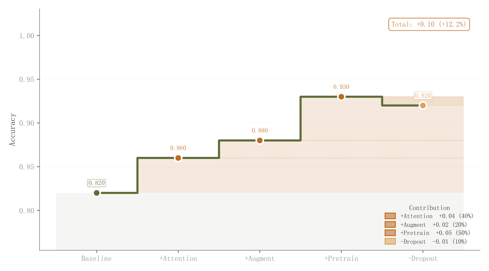

# 018 · 累计增益阶梯与贡献色带

ID：`advanced.waterfall`

用途：每个模块给累计表现增加或减少多少？

标签：变化、组成、比较

别名：增益分解、消融贡献、阶梯面积

## 数据要求

- 起始值
- 按步骤排列的增量

## 组合结构

阶梯线和圆点；各步贡献带向右延展

## 视觉特点

- 透明层带叠加
- 顶部数值
- 总增益框

## 适配注意

实际不是浮动柱瀑布图；固定透明度贡献带而非连续渐变；增量顺序决定展示路径。

## 预览

## 来源与核对

原名称：Waterfall Chart — 瀑布图（彩色渐变柱图 + 连接线 + 顶部数值标注）
原始代码：[查看](../sources/advanced.waterfall/original.html)
预览范围：首个主要Python示例
已查看对应预览并核对主要绘图和数据代码；卡片不是统计有效性认证。

预览执行兼容调整：移除重复 handlelength 参数，保留首次声明的 1.6

## 相近候选

- [增减贡献浮动柱瀑布](competition.waterfall.md)
- [消融配置柱状比较](academic.ablation.md)
- [相对基线发散条形](advanced.diverging_bar.md)

<!-- fidelity:start -->
## 源码保真要点

以当前完整配方源码为底稿；下列行号指向解释预览的快照。数据适配不应顺手删掉这些视觉结构。

### 阶梯线下的延展贡献带

- 保留重点：保留累计阶梯、白边圆点、各步贡献带向右延展的透明叠加；这个配方的设计不是浮动柱瀑布图。
- 可适配：步数、正负贡献和范围按当前数据重算；标签位置可调，不能平滑掉离散阶梯。
- 源码：[L30–31](../sources/advanced.waterfall/original.html#L30) · [L36–37](../sources/advanced.waterfall/original.html#L36) · [L40–40](../sources/advanced.waterfall/original.html#L40) · [L45–46](../sources/advanced.waterfall/original.html#L45)

按现有审图流程对照实际输出；有疑问时可用[源码差异提示](../../template-fidelity.md)。
