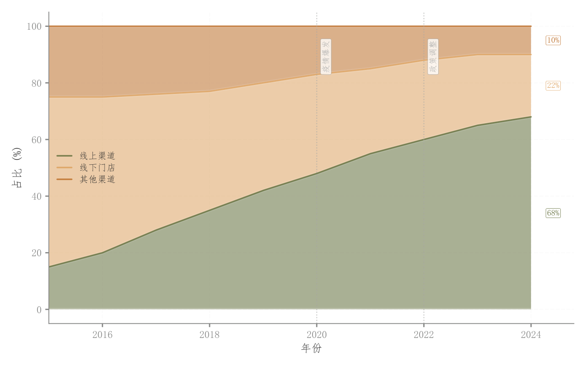

# 008 · 堆叠面积与事件标记

ID：`basic.area`

用途：组成份额如何随时间转移？

标签：组成、趋势

别名：堆叠面积与事件标记

## 数据要求

- 有序时间
- 各组成分量
- 事件日期

## 组合结构

单面板累计面积堆叠；事件竖线

## 视觉特点

- 三层近重合填充
- 顶部轮廓
- 末端占比标签

## 适配注意

主要区域近似纯色，深浅变化集中在边缘；百分比数据需保证每期加总口径一致。

## 预览

## 来源与核对

原名称：面积图（渐变填充 + 事件标记线 + 端点标注）
原始代码：[查看](../sources/basic.area/original.html)
预览范围：首个主要Python示例
已查看对应预览并核对主要绘图和数据代码；卡片不是统计有效性认证。

## 相近候选

- [居中流带图](advanced.streamgraph.md)
- [方差分解总览与次要成分放大](empirical.variance_decomposition.md)

<!-- fidelity:start -->
## 源码保真要点

以当前完整配方源码为底稿；下列行号指向解释预览的快照。数据适配不应顺手删掉这些视觉结构。

### 三层叠加与累计轮廓

- 保留重点：保留近重合的三层填充及每成分顶部独立轮廓；累计上下边界随成分递增，不以单片不透明面积代替。
- 可适配：成分数与实际规模可变，内缩量按量纲调整以避免薄成分翻转；事件线仅标真实事件。
- 源码：[L20–21](../sources/basic.area/original.html#L20) · [L23–23](../sources/basic.area/original.html#L23)

按现有审图流程对照实际输出；有疑问时可用[源码差异提示](../../template-fidelity.md)。
