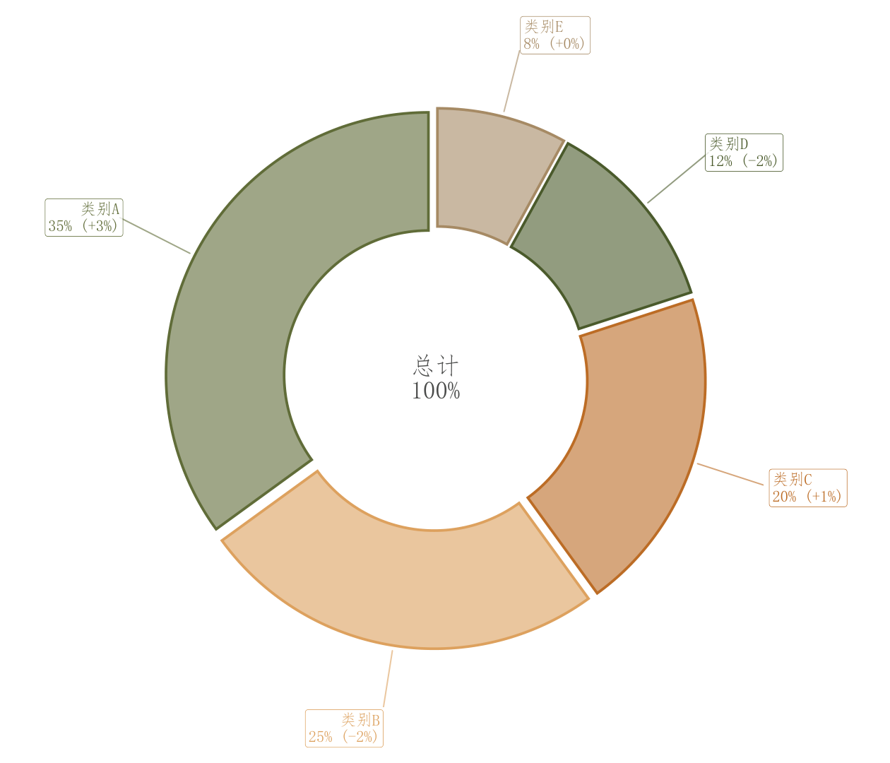

# 006 · 环形构成图

ID：`basic.donut`

用途：少量类别占整体多少，各自变化多少？

标签：组成

别名：环形构成图

## 数据要求

- 非负分量
- 类别名
- 可选同比或变化值

## 组合结构

单面板圆环；中心摘要；外置引线标签

## 视觉特点

- 浅色扇区
- 同色描边
- 白色分隔
- 中心留白

## 适配注意

类别过多或占比接近时难精确比较；变化率是另一个输入，不由当前占比自动得到。

## 预览

## 来源与核对

原名称：环形图（淡色填充 + 原色边框 + 外部连线标签 + 变化率标注）
原始代码：[查看](../sources/basic.donut/original.html)
预览范围：首个主要Python示例
已查看对应预览并核对主要绘图和数据代码；卡片不是统计有效性认证。

<!-- fidelity:start -->
## 源码保真要点

以当前完整配方源码为底稿；下列行号指向解释预览的快照。数据适配不应顺手删掉这些视觉结构。

### 浅扇区和环形留白

- 保留重点：保留浅扇区、独立深描边、环宽形成的中心留白及外置引线标签，不改成实心饼。
- 可适配：类别、扇区角度、引线位置随真实占比变化；中心摘要与变化标签必须有依据。
- 源码：[L17–21](../sources/basic.donut/original.html#L17) · [L25–25](../sources/basic.donut/original.html#L25) · [L37–38](../sources/basic.donut/original.html#L37)

按现有审图流程对照实际输出；有疑问时可用[源码差异提示](../../template-fidelity.md)。
