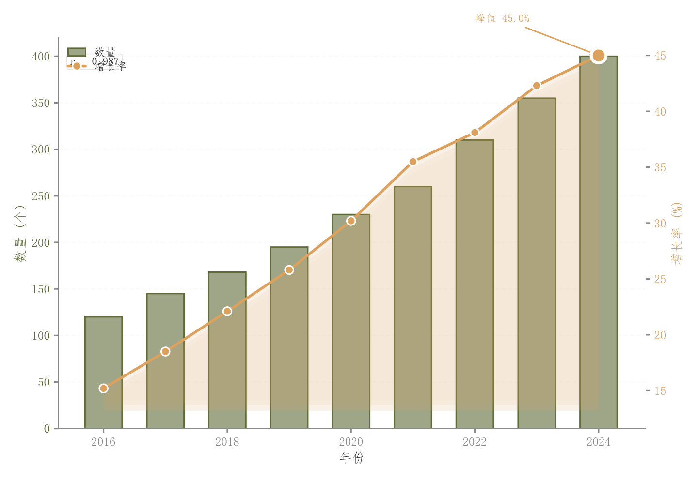

# 010 · 柱线双轴组合

ID：`basic.dual_axis`

用途：总量与另一项不同单位指标如何共同变化？

标签：趋势、比较、组合

别名：柱线双轴组合

## 数据要求

- 同一时间轴
- 两组数值

## 组合结构

左轴柱；右轴折线和填充

## 视觉特点

- 浅柱描边
- 三层折线下填充
- 峰值高亮
- 相关框

## 适配注意

双轴缩放会影响观感；三层填充并非连续渐变；相关不代表因果。

## 预览

## 来源与核对

原名称：双轴图（淡色填充 + 原色边框柱 + 渐变填充折线 + 相关性标注框 + 峰值高亮）
原始代码：[查看](../sources/basic.dual_axis/original.html)
预览范围：首个主要Python示例
已查看对应预览并核对主要绘图和数据代码；卡片不是统计有效性认证。

<!-- fidelity:start -->
## 源码保真要点

以当前完整配方源码为底稿；下列行号指向解释预览的快照。数据适配不应顺手删掉这些视觉结构。

### 双轴浅柱与分层曲线填充

- 保留重点：保留两轴的柱与折线区分、浅柱深边和阴影、三层折线下填充及白边峰值。
- 可适配：两轴单位与刻度分别适配，填充基线随数据范围调整；相关摘要重新计算。
- 源码：[L14–16](../sources/basic.dual_axis/original.html#L14) · [L19–19](../sources/basic.dual_axis/original.html#L19) · [L22–23](../sources/basic.dual_axis/original.html#L22) · [L25–27](../sources/basic.dual_axis/original.html#L25)

按现有审图流程对照实际输出；有疑问时可用[源码差异提示](../../template-fidelity.md)。
