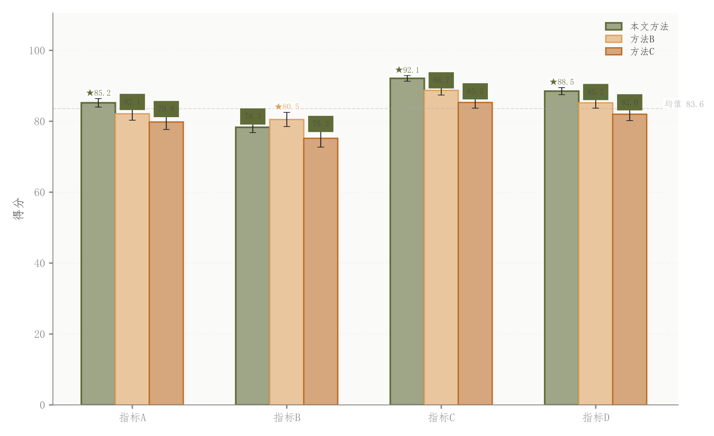

# 001 · 分组柱状对比

ID：`basic.grouped_bar`

用途：不同方法在多个指标上谁更高、波动多大？

标签：比较、误差

别名：grouped bar、误差棒柱状图

## 数据要求

- 类别×方法的数值矩阵
- 每项误差长度
- 指标名称

## 组合结构

单面板；每类并排多根柱

## 视觉特点

- 浅填充与较深描边
- 柱后阴影
- 误差棒
- 最优星号与均值线

## 适配注意

背景为固定透明度纯色，非连续渐变；误差含义需明确；不同量纲不直接共用高度比较。

## 预览

## 来源与核对

原名称：分组柱状图（Grouped Bar）— 淡色填充 + 原色边框 + 参考线 + 顶部数值 + 最优高亮
原始代码：[查看](../sources/basic.grouped_bar/original.html)
预览范围：首个主要Python示例
已查看对应预览并核对主要绘图和数据代码；卡片不是统计有效性认证。

<!-- fidelity:start -->
## 源码保真要点

以当前完整配方源码为底稿；下列行号指向解释预览的快照。数据适配不应顺手删掉这些视觉结构。

### 浅柱、描边与背后阴影

- 保留重点：保留 _lighten 浅填充、同色深描边、后方偏移浅阴影与独立误差棒，不合并成实色柱。最优高亮和均值参考有数据依据时保留。
- 可适配：组数、柱宽、误差长度、标签位置可调；误差和最优方向按数据含义计算。
- 源码：[L30–30](../sources/basic.grouped_bar/original.html#L30) · [L32–36](../sources/basic.grouped_bar/original.html#L32) · [L50–50](../sources/basic.grouped_bar/original.html#L50)

按现有审图流程对照实际输出；有疑问时可用[源码差异提示](../../template-fidelity.md)。
