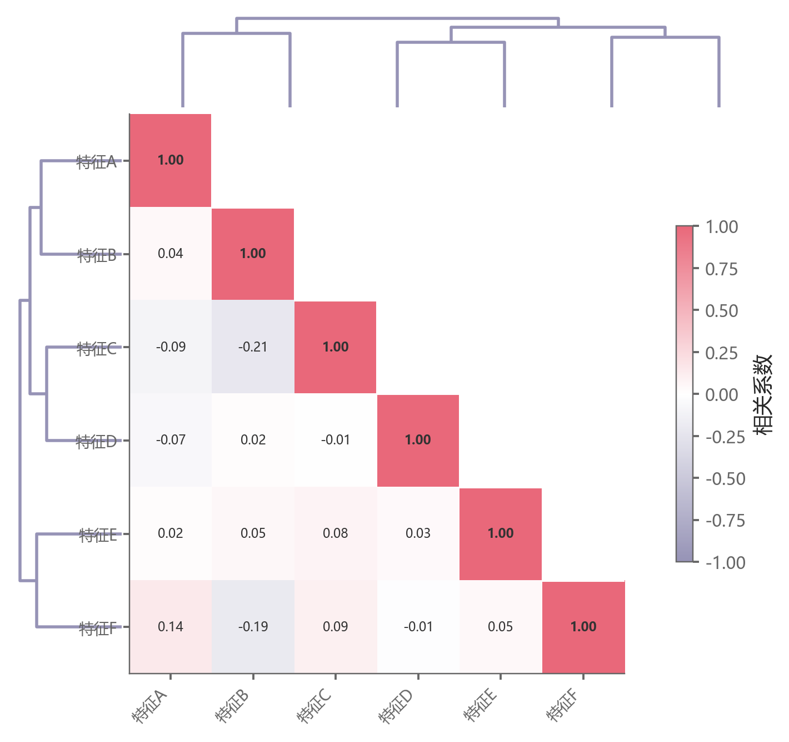

# 005 · 带双侧树状图的下三角相关矩阵

ID：`basic.heatmap`

用途：变量两两相关及相近结构怎样？

标签：关联、矩阵、聚类

别名：带双侧树状图的下三角相关矩阵

## 数据要求

- 样本×连续变量矩阵
- 变量标签

## 组合结构

下三角热力图；顶部及左侧树状图；右侧色条

## 视觉特点

- 红蓝发散色阶
- 白色上三角
- 格内数值

## 适配注意

当前树叶顺序未同步重排相关矩阵；左侧树线邻近标签。用于选结构时需知道这些原示例限制。

## 预览

## 来源与核对

原名称：热力图（fig.add_axes 手动布局 + 聚类树状图 + 下三角遮罩 + 分组色条）
原始代码：[查看](../sources/basic.heatmap/original.html)
预览范围：首个主要Python示例
已查看对应预览并核对主要绘图和数据代码；卡片不是统计有效性认证。

## 相近候选

- [分布与Pearson成对关系矩阵](advanced.pair_plot.md)
- [残差小提琴与Pearson完整组合](template.sem_violin_pearson.md)
- [相关显著性热图与顶部树](empirical.correlation_heatmap.md)
- [简洁下三角相关矩阵](competition.correlation_matrix.md)

<!-- fidelity:start -->
## 源码保真要点

以当前完整配方源码为底稿；下列行号指向解释预览的快照。数据适配不应顺手删掉这些视觉结构。

### 聚类与遮罩下三角

- 保留重点：保留树状图对应的变量重排、下三角遮罩、数值与色条；相关使用发散映射。
- 可适配：变量数量、排序、字体和发散色相可变；无数据处与零相关区分。
- 源码：[L45–45](../sources/basic.heatmap/original.html#L45) · [L63–64](../sources/basic.heatmap/original.html#L63) · [L66–66](../sources/basic.heatmap/original.html#L66)

按现有审图流程对照实际输出；有疑问时可用[源码差异提示](../../template-fidelity.md)。

## 项目配色

热图默认读取项目配色；连续插值、中性色、透明度及数据归一化保留，数值文字按实际底色选择对比色。
