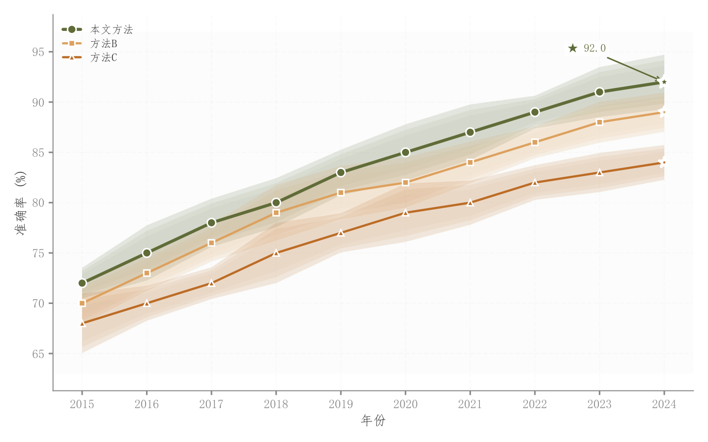

# 003 · 多序列折线与分层区间带

ID：`basic.line`

用途：不同序列如何变化，波动范围是否重叠？

标签：趋势、误差

别名：多序列折线与分层区间带

## 数据要求

- 有序横轴
- 各序列数值与误差宽度

## 组合结构

单面板多折线；嵌套色带

## 视觉特点

- 三层透明置信带
- 不同点形
- 主序列加粗
- 极值箭头

## 适配注意

背景为纯色；色带为三档叠加，非连续渐变；示例误差随机生成，实用时替换真实区间。

## 预览

## 来源与核对

原名称：折线图（渐变填充 + 极值标注箭头 + 微妙网格）
原始代码：[查看](../sources/basic.line/original.html)
预览范围：首个主要Python示例
已查看对应预览并核对主要绘图和数据代码；卡片不是统计有效性认证。

<!-- fidelity:start -->
## 源码保真要点

以当前完整配方源码为底稿；下列行号指向解释预览的快照。数据适配不应顺手删掉这些视觉结构。

### 三层色带的外缘可见性

- 保留重点：区间由外向内收窄，alpha 按 0.15→0.08→0.03 对应外、中、内层。保留宽度与透明度的对应关系，不能仅因三层都存在就认定保真。
- 可适配：以真实 SD/SE/CI 或明确的范围替换模拟宽度；区间含义、宽度和坐标可变。数据不支持区间时不造数，并说明省略。
- 源码：[L24–29](../sources/basic.line/original.html#L24)

### 主次折线、白边点和极值

- 保留重点：保留主次线宽、不同点形、白色点边及有数据依据的极值标记；换色不应覆盖这些设置。
- 可适配：主序列身份、点数、极值方向和标注位置按任务变化；没有主序列时不虚构主次。
- 源码：[L31–46](../sources/basic.line/original.html#L31)

按现有审图流程对照实际输出；有疑问时可用[源码差异提示](../../template-fidelity.md)。
