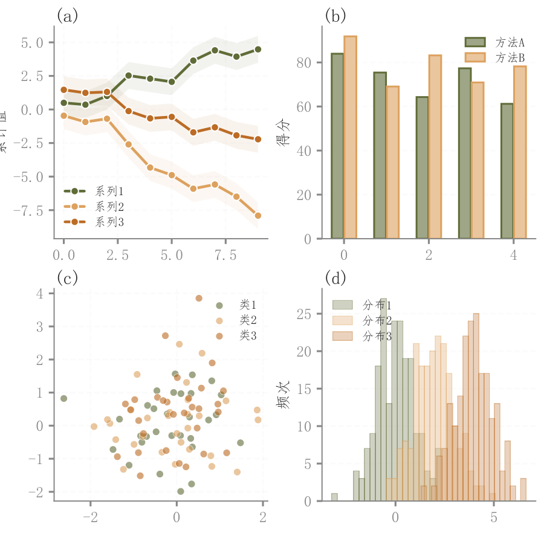

# 012 · 折线柱状散点直方四面板

ID：`basic.multipanel`

用途：怎样在一页给出四种互补概览？

标签：组合、趋势、比较、分布

别名：折线柱状散点直方四面板

## 数据要求

- 趋势序列、类别数值、配对样本和分组分布

## 组合结构

2×2：折线、分组柱、散点、直方图

## 视觉特点

- 统一浅填充与点形
- 紧凑子图标签

## 适配注意

示例四组数据相互独立；左上仅单层色带，左下未实际绘制注释所称KDE；组合语义需来自实际任务。

## 预览

## 来源与核对

原名称：多面板子图（淡色填充 + 原色边框 + 带背景框标签 + 统一风格）
原始代码：[查看](../sources/basic.multipanel/original.html)
预览范围：首个主要Python示例
已查看对应预览并核对主要绘图和数据代码；卡片不是统计有效性认证。

<!-- fidelity:start -->
## 源码保真要点

以当前完整配方源码为底稿；下列行号指向解释预览的快照。数据适配不应顺手删掉这些视觉结构。

### 四面板共用视觉语言

- 保留重点：保留折线带、浅柱深边、透明散点和半透明直方的面板差异及共用样式，不各面板另起风格。
- 可适配：版面尺寸与数据规模可调；面板是否保留按表达目的决定，不能造区间补结构。
- 源码：[L13–14](../sources/basic.multipanel/original.html#L13) · [L15–15](../sources/basic.multipanel/original.html#L15) · [L28–29](../sources/basic.multipanel/original.html#L28) · [L40–41](../sources/basic.multipanel/original.html#L40) · [L51–52](../sources/basic.multipanel/original.html#L51)

按现有审图流程对照实际输出；有疑问时可用[源码差异提示](../../template-fidelity.md)。
