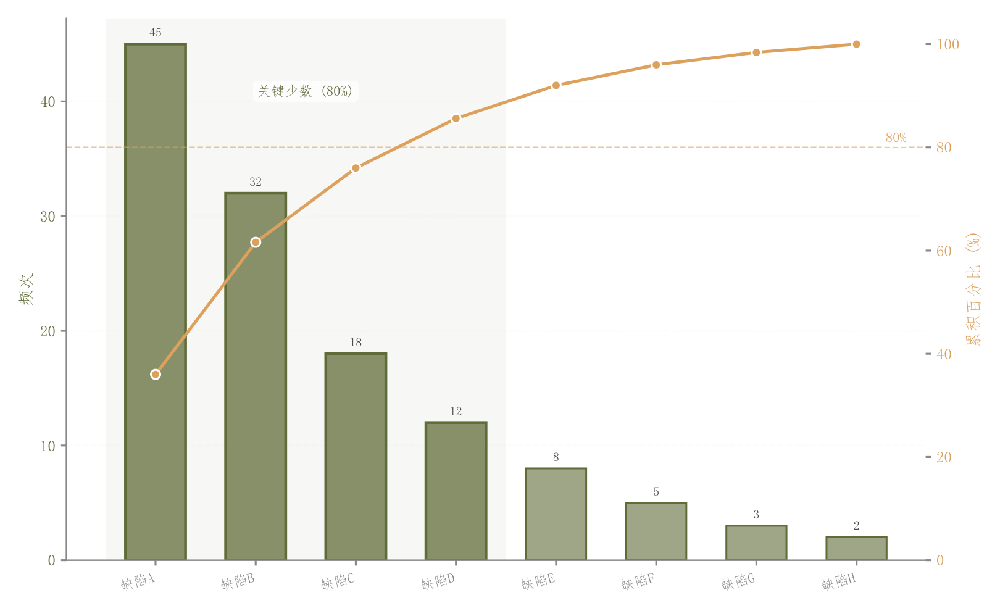

# 009 · 贡献排序与累计占比

ID：`basic.pareto`

用途：哪些少数因素贡献了大部分总量？

标签：排序、组成、组合

别名：贡献累计、80/20

## 数据要求

- 非负类别贡献值

## 组合结构

降序柱图；右轴累计百分比曲线

## 视觉特点

- 重点柱加深
- 80%阈值
- 贡献区域浅阴影

## 适配注意

这是贡献累计图，不是多目标优化Pareto前沿；累计占比要求总量为正。

## 预览

## 来源与核对

原名称：竖向帕累托图（柱状图 + 累积百分比折线 + 80% 分界线）
原始代码：[查看](../sources/basic.pareto/original.html)
预览范围：首个主要Python示例
已查看对应预览并核对主要绘图和数据代码；卡片不是统计有效性认证。

<!-- fidelity:start -->
## 源码保真要点

以当前完整配方源码为底稿；下列行号指向解释预览的快照。数据适配不应顺手删掉这些视觉结构。

### 贡献柱和累计曲线

- 保留重点：保留浅柱深边、重点柱加深、累计百分比曲线与贡献区域浅阴影。
- 可适配：按当前贡献值排序并重算累计占比；阈值按问题设定，标签空间可调。
- 源码：[L21–23](../sources/basic.pareto/original.html#L21) · [L28–28](../sources/basic.pareto/original.html#L28) · [L38–39](../sources/basic.pareto/original.html#L38) · [L49–49](../sources/basic.pareto/original.html#L49)

按现有审图流程对照实际输出；有疑问时可用[源码差异提示](../../template-fidelity.md)。
