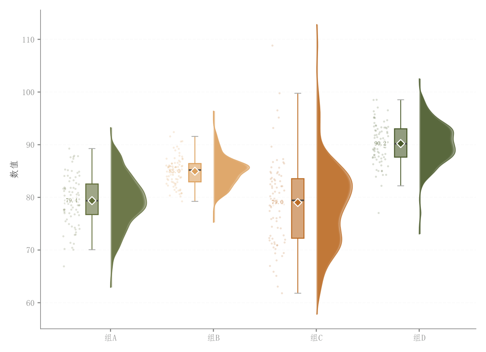

# 007 · 竖向雨云分布组合

ID：`basic.raincloud`

用途：各组样本的中心、离散与密度形状如何？

标签：分布、比较、组合

别名：raincloud、雨云图、半小提琴、箱线散点组合

## 数据要求

- 分组标签与每组原始连续样本

## 组合结构

每组左散点、中窄箱、右半小提琴

## 视觉特点

- 六层透明半小提琴
- 白边均值菱形
- 错位排列

## 适配注意

六层叠加而非连续渐变；小样本、常量或重复值很多时密度形状需谨慎适配。

## 预览

## 来源与核对

原名称：Rain Cloud 图（淡色填充 + 原色边框 + 半小提琴 + 箱线 + 抖动散点 + 均值菱形）
原始代码：[查看](../sources/basic.raincloud/original.html)
预览范围：首个主要Python示例
已查看对应预览并核对主要绘图和数据代码；卡片不是统计有效性认证。

## 相近候选

- [完整小提琴与箱线显著性比较](basic.raincloud_violin.md)
- [类别内多方法小提琴](advanced.grouped_violin.md)
- [堆叠山脊密度](advanced.ridgeline.md)
- [横向长尾分布雨云与分位标记](empirical.raincloud.md)
- [雨云分布与效应量显著性](academic.confusion_matrix.md)
- [模型误差横向雨云](empirical.prediction_error_raincloud.md)

<!-- fidelity:start -->
## 源码保真要点

以当前完整配方源码为底稿；下列行号指向解释预览的快照。数据适配不应顺手删掉这些视觉结构。

### 六层半密度与深轮廓

- 保留重点：保留六层填充的偏移、收缩和 alpha 计算，以及最外侧独立轮廓；不压成一片纯色。
- 可适配：由真实组样本计算密度，可调带宽和宽度；检查小样本、常量组是否支持 KDE。
- 源码：[L20–31](../sources/basic.raincloud/original.html#L20)

### 散点、窄箱、半小提琴错位

- 保留重点：沿横向保留左散点、中窄箱、右半小提琴关系和白边均值菱形；箱体保留浅填充与深描边。
- 可适配：组数、间距、点密度和标签可调，均值由当前样本计算，不固定示例偏移量。
- 源码：[L34–48](../sources/basic.raincloud/original.html#L34)

按现有审图流程对照实际输出；有疑问时可用[源码差异提示](../../template-fidelity.md)。
