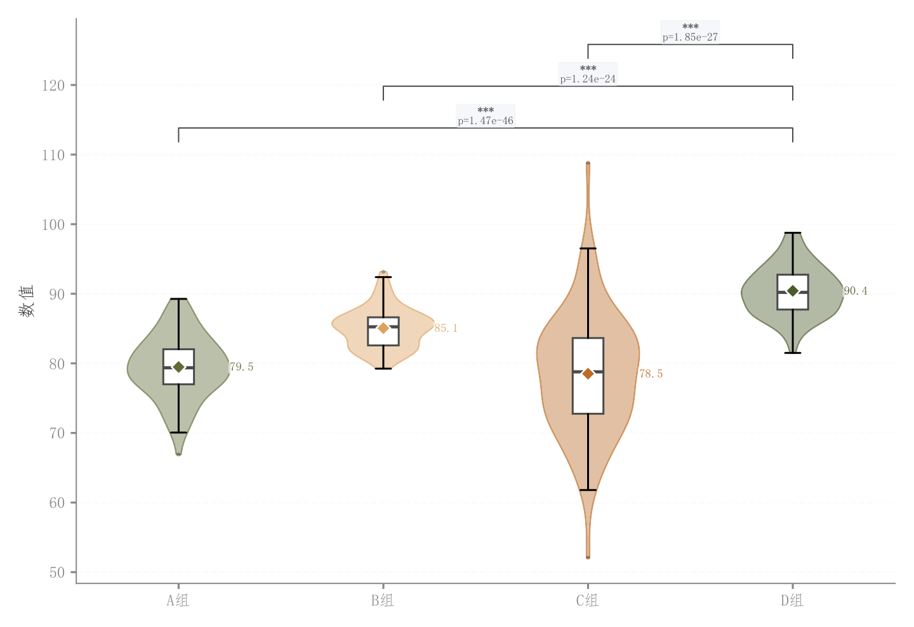

# 011 · 完整小提琴与箱线显著性比较

ID：`basic.raincloud_violin`

用途：多组分布差异及组间检验结果如何？

标签：分布、比较、组合

别名：violin、小提琴箱线组合

## 数据要求

- 各组原始连续样本
- 分组标签

## 组合结构

竖向对称小提琴；内部窄箱；顶部检验括号

## 视觉特点

- 浅色琴体与轮廓
- 均值菱形
- 显著性括号

## 适配注意

实际无独立抖动散点，区别于半小提琴雨云图；检验方法和多重比较需匹配任务。

## 预览

## 来源与核对

原名称：Rain Cloud 小提琴图（淡色填充 + 原色边框 + 显著性括号 + 完整分布展示）
原始代码：[查看](../sources/basic.raincloud_violin/original.html)
预览范围：首个主要Python示例
已查看对应预览并核对主要绘图和数据代码；卡片不是统计有效性认证。

## 相近候选

- [竖向雨云分布组合](basic.raincloud.md)
- [类别内多方法小提琴](advanced.grouped_violin.md)
- [堆叠山脊密度](advanced.ridgeline.md)
- [横向长尾分布雨云与分位标记](empirical.raincloud.md)
- [雨云分布与效应量显著性](academic.confusion_matrix.md)
- [模型误差横向雨云](empirical.prediction_error_raincloud.md)

<!-- fidelity:start -->
## 源码保真要点

以当前完整配方源码为底稿；下列行号指向解释预览的快照。数据适配不应顺手删掉这些视觉结构。

### 对称琴体与内部窄箱

- 保留重点：保留浅色半透明对称琴体、深轮廓、内部窄箱与均值菱形；不是左右错位的半雨云。
- 可适配：组数与间距可变；箱线和均值由样本计算，比较括号只用于有效检验。
- 源码：[L14–15](../sources/basic.raincloud_violin/original.html#L14) · [L21–21](../sources/basic.raincloud_violin/original.html#L21) · [L24–29](../sources/basic.raincloud_violin/original.html#L24) · [L33–34](../sources/basic.raincloud_violin/original.html#L33)

按现有审图流程对照实际输出；有疑问时可用[源码差异提示](../../template-fidelity.md)。
