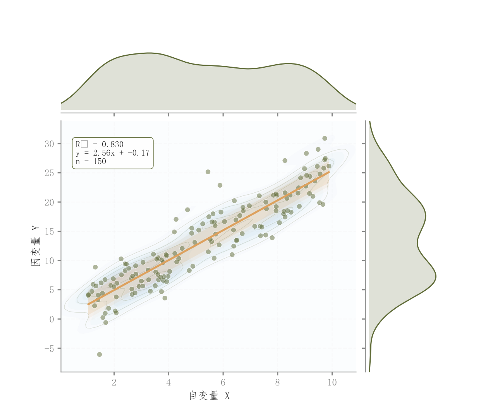

# 004 · 散点回归与双边际密度

ID：`basic.scatter_regression`

用途：两个连续变量如何关联，各自分布怎样？

标签：关联、分布、组合

别名：散点回归与双边际密度

## 数据要求

- 逐样本配对的x、y
- 可选样本标签

## 组合结构

中央散点；上方x密度；右方y密度

## 视觉特点

- 二维KDE等高线
- 回归线与色带
- 浅色边际填充
- 拟合信息框

## 适配注意

需要原始配对样本；KDE不适合常量或极少样本；示例回归色带不能直接当作已计算的正式置信区间。

## 预览

## 来源与核对

原名称：散点图（KDE 等高线 + 柔和边际密度 + 回归公式框 + 年份标签）
原始代码：[查看](../sources/basic.scatter_regression/original.html)
预览范围：首个主要Python示例
已查看对应预览并核对主要绘图和数据代码；卡片不是统计有效性认证。

## 相近候选

- [简洁回归散点与边际KDE](competition.scatter_regression_marginals.md)
- [二维密度与双边际联合图](competition.kde_joint.md)
- [六边形计数与边际直方](competition.hexbin_joint.md)
- [气泡与双边际密度](competition.bubble_joint.md)
- [二维密度等高线与散点](competition.bubble_kde.md)

<!-- fidelity:start -->
## 源码保真要点

以当前完整配方源码为底稿；下列行号指向解释预览的快照。数据适配不应顺手删掉这些视觉结构。

### 密度、回归和双边际的层次

- 保留重点：保留中央浅密度面与轮廓、白边散点、回归色带，以及顶部和右侧的浅填充密度，不缩成单散点图。
- 可适配：由真实配对样本计算回归和区间；KDE 带宽、边际大小、连续色相可调。
- 源码：[L28–28](../sources/basic.scatter_regression/original.html#L28) · [L29–29](../sources/basic.scatter_regression/original.html#L29) · [L32–32](../sources/basic.scatter_regression/original.html#L32) · [L42–44](../sources/basic.scatter_regression/original.html#L42) · [L56–56](../sources/basic.scatter_regression/original.html#L56) · [L67–67](../sources/basic.scatter_regression/original.html#L67)

按现有审图流程对照实际输出；有疑问时可用[源码差异提示](../../template-fidelity.md)。
