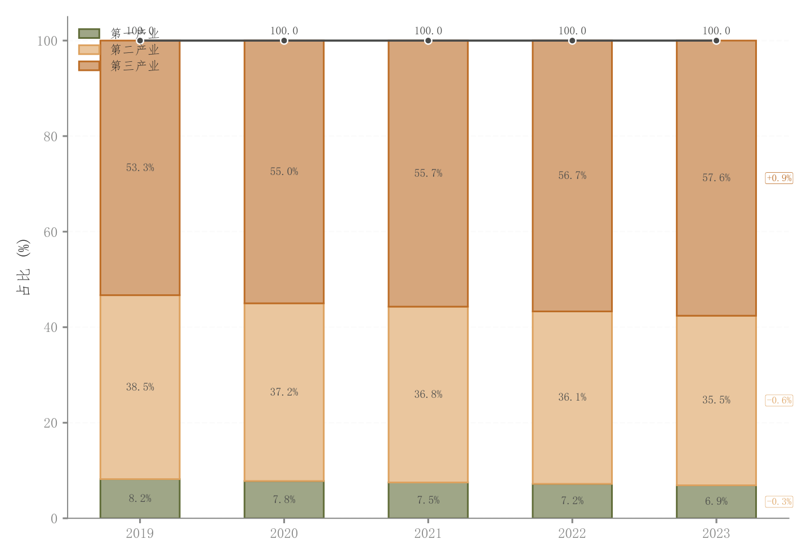

# 002 · 堆叠柱与总量趋势

ID：`basic.stacked_bar`

用途：各时期总量由哪些部分构成？

标签：组成、趋势

别名：堆叠柱与总量趋势

## 数据要求

- 时期×成分的非负数值
- 类别标签

## 组合结构

单面板堆叠柱；柱顶总量折线

## 视觉特点

- 浅填充和描边
- 柱内占比
- 末端同比标注

## 适配注意

成分应可相加；总量与百分比读法分开；不是各组原始样本分布。

## 预览

## 来源与核对

原名称：堆叠柱状图（Stacked Bar）— 淡色填充 + 原色边框 + 趋势线 + 自动对比度标签 + 同比变化
原始代码：[查看](../sources/basic.stacked_bar/original.html)
预览范围：首个主要Python示例
已查看对应预览并核对主要绘图和数据代码；卡片不是统计有效性认证。

<!-- fidelity:start -->
## 源码保真要点

以当前完整配方源码为底稿；下列行号指向解释预览的快照。数据适配不应顺手删掉这些视觉结构。

### 堆叠内部与柱顶总量

- 保留重点：保留浅填充深描边、逐层 bottom 累加及柱顶总量折线，内部标签与总量标签分开。
- 可适配：成分数、时间点、位置与精度可调；百分比和总量分清，成分必须可相加。
- 源码：[L22–24](../sources/basic.stacked_bar/original.html#L22) · [L39–40](../sources/basic.stacked_bar/original.html#L39)

按现有审图流程对照实际输出；有疑问时可用[源码差异提示](../../template-fidelity.md)。
