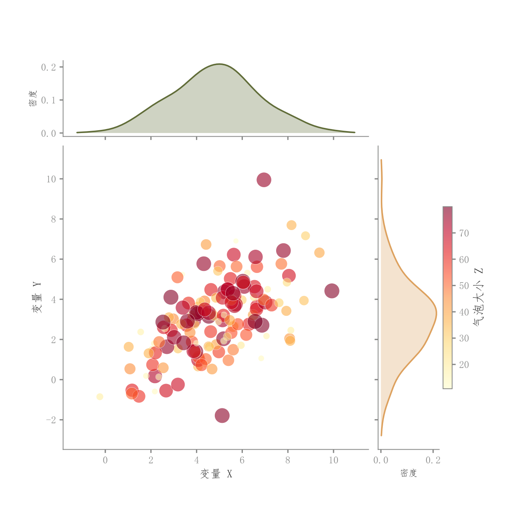

# 100 · 气泡与双边际密度

ID：`competition.bubble_joint`

用途：两个变量的关系与第三个量如何同时展示？

标签：关联、多维、分布、组合

别名：气泡与双边际密度

## 数据要求

- 配对x、y与非负大小变量z

## 组合结构

主气泡图；顶部与右侧KDE；侧色条

## 视觉特点

- 气泡大小和颜色均编码z
- 透明重叠
- 浅边际密度

## 适配注意

与仅固定大小散点的bubble_kde不同；大小图例和面积缩放需按数值含义适配。

## 预览

## 来源与核对

原名称：气泡图 + KDE 联合分布（Jointplot 风格）
原始代码：[查看](../sources/competition.bubble_joint/original.html)
预览范围：首个主要Python示例
已查看对应预览并核对主要绘图和数据代码；卡片不是统计有效性认证。

## 相近候选

- [散点回归与双边际密度](basic.scatter_regression.md)
- [简洁回归散点与边际KDE](competition.scatter_regression_marginals.md)
- [二维密度与双边际联合图](competition.kde_joint.md)
- [六边形计数与边际直方](competition.hexbin_joint.md)
- [二维密度等高线与散点](competition.bubble_kde.md)

<!-- fidelity:start -->
## 源码保真要点

以当前完整配方源码为底稿；下列行号指向解释预览的快照。数据适配不应顺手删掉这些视觉结构。

### 大小颜色双编码和边际

- 保留重点：保留 z 同时映射气泡大小与连续颜色、透明叠加，以及顶部/右侧浅密度和轮廓。
- 可适配：变量、大小缩放、带宽和色相可变，气泡面积与映射关系说明清楚；不能把点都设成同样大小。
- 源码：[L20–21](../sources/competition.bubble_joint/original.html#L20) · [L27–27](../sources/competition.bubble_joint/original.html#L27) · [L35–35](../sources/competition.bubble_joint/original.html#L35) · [L43–43](../sources/competition.bubble_joint/original.html#L43)

按现有审图流程对照实际输出；有疑问时可用[源码差异提示](../../template-fidelity.md)。
