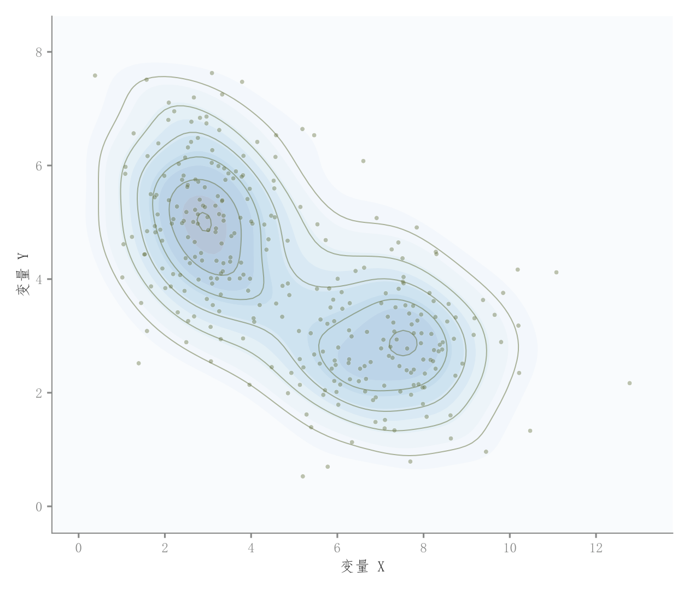

# 101 · 二维密度等高线与散点

ID：`competition.bubble_kde`

用途：样本在哪些二维区域聚集，是否有多个峰？

标签：关联、分布

别名：KDE contour、二维密度散点

## 数据要求

- 逐样本配对x、y

## 组合结构

单面板散点叠加二维KDE

## 视觉特点

- 蓝色透明密度层
- 轮廓线
- 小散点

## 适配注意

原名气泡图，实际散点固定大小，没有第三变量；密度依赖带宽与样本量。

## 预览

## 来源与核对

原名称：气泡图 + KDE 叠加
原始代码：[查看](../sources/competition.bubble_kde/original.html)
预览范围：首个主要Python示例
已查看对应预览并核对主要绘图和数据代码；卡片不是统计有效性认证。

## 相近候选

- [散点回归与双边际密度](basic.scatter_regression.md)
- [简洁回归散点与边际KDE](competition.scatter_regression_marginals.md)
- [二维密度与双边际联合图](competition.kde_joint.md)
- [六边形计数与边际直方](competition.hexbin_joint.md)
- [气泡与双边际密度](competition.bubble_joint.md)

<!-- fidelity:start -->
## 源码保真要点

以当前完整配方源码为底稿；下列行号指向解释预览的快照。数据适配不应顺手删掉这些视觉结构。

### 二维浅密度与轮廓

- 保留重点：保留浅密度层、独立轮廓与透明小散点；实际代码固定点大小，没有第三变量气泡映射。
- 可适配：KDE 带宽、等高线级数、连续色相和点密度可变，保持密度图与样本来自同一数据。
- 源码：[L18–18](../sources/competition.bubble_kde/original.html#L18) · [L19–19](../sources/competition.bubble_kde/original.html#L19) · [L22–22](../sources/competition.bubble_kde/original.html#L22)

按现有审图流程对照实际输出；有疑问时可用[源码差异提示](../../template-fidelity.md)。
