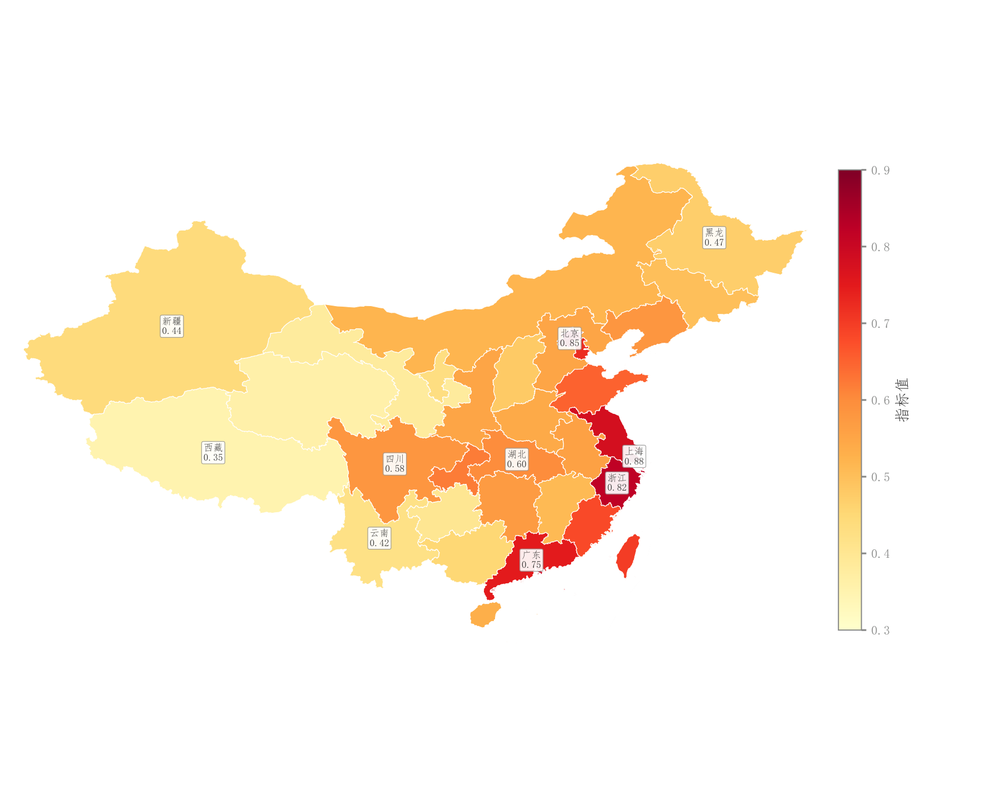

# 086 · 中国省级数值分级地图

ID：`competition.china_choropleth`

用途：区域数值高低和地理格局怎样？

标签：空间、比较

别名：中国省级数值分级地图

## 数据要求

- 省份名称或ID与数值
- 匹配的GeoJSON

## 组合结构

省级多边形地图；右侧色条

## 视觉特点

- 黄红连续数值着色
- 浅边界
- 省名标签

## 适配注意

原预览东部标签较密；区域匹配、缺值及边界资源需要对应实际数据，不能把缺值补零。

## 预览

## 来源与核对

原名称：中国省份地图（Choropleth Map）
原始代码：[查看](../sources/competition.china_choropleth/original.html)
预览范围：首个主要Python示例
已查看对应预览并核对主要绘图和数据代码；卡片不是统计有效性认证。

<!-- fidelity:start -->
## 源码保真要点

以当前完整配方源码为底稿；下列行号指向解释预览的快照。数据适配不应顺手删掉这些视觉结构。

### 连续省域着色与缺失区分

- 保留重点：保留省域连续数值色阶、浅色边界、省名数值与色条，缺失区域单独处理。
- 可适配：地图范围、数据和连续色相可变；缺失不是零，地理边界用实际底图，避免靠色名选图。
- 源码：[L60–61](../sources/competition.china_choropleth/original.html#L60) · [L63–63](../sources/competition.china_choropleth/original.html#L63) · [L72–75](../sources/competition.china_choropleth/original.html#L72) · [L127–130](../sources/competition.china_choropleth/original.html#L127) · [L137–137](../sources/competition.china_choropleth/original.html#L137)

按现有审图流程对照实际输出；有疑问时可用[源码差异提示](../../template-fidelity.md)。
