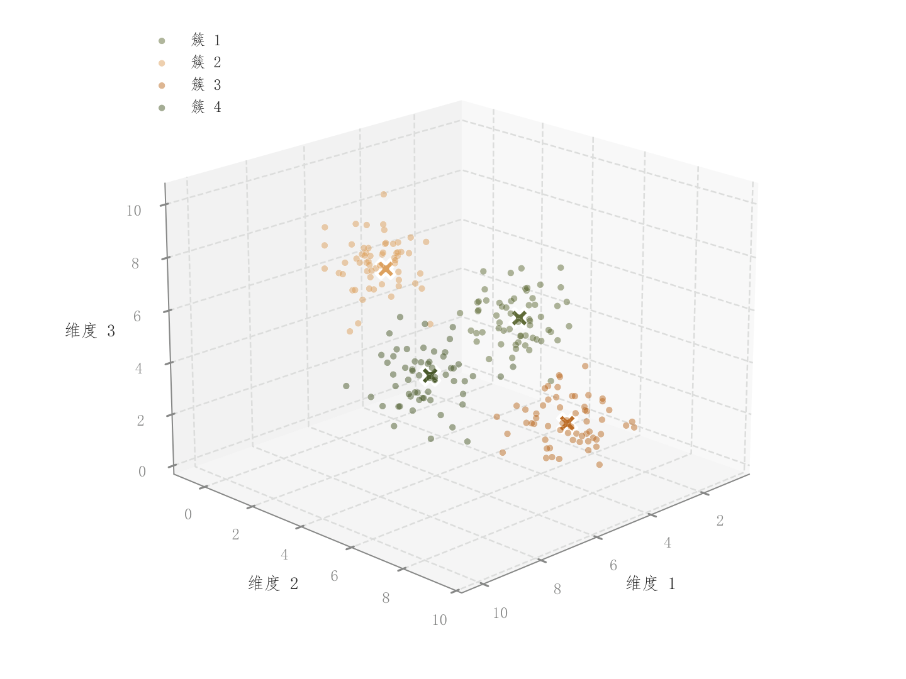

# 106 · 三维分组散点

ID：`competition.cluster_3d`

用途：三维空间中的类别中心和分离程度怎样？

标签：三维、聚类

别名：三维分组散点

## 数据要求

- 三维坐标与类别标签

## 组合结构

单3D轴；分组点云

## 视觉特点

- 小透明点
- 类中心文字
- 类别图例

## 适配注意

没有academic.benchmark_table的透明凸包；前后遮挡与视角影响分离观感。

## 预览

## 来源与核对

原名称：3D 聚类散点图（彩色分组 + 原色边框点 + 文本标注）
原始代码：[查看](../sources/competition.cluster_3d/original.html)
预览范围：首个主要Python示例
已查看对应预览并核对主要绘图和数据代码；卡片不是统计有效性认证。

## 相近候选

- [三维分组点云与凸包投影](academic.benchmark_table.md)
- [二维嵌入簇与密度轮廓](academic.tsne_umap.md)
- [聚类分布与轮廓系数双面板](competition.kmeans.md)

<!-- fidelity:start -->
## 源码保真要点

以当前完整配方源码为底稿；下列行号指向解释预览的快照。数据适配不应顺手删掉这些视觉结构。

### 三维浅点云与中心叉号

- 保留重点：保留分组透明小点和同类色白边大叉中心，图例能对应每个类。
- 可适配：样本、簇中心和视角按实际数据更新，点密度可调，不能让中心被不透明点云遮没。
- 源码：[L19–20](../sources/competition.cluster_3d/original.html#L19) · [L21–22](../sources/competition.cluster_3d/original.html#L21) · [L28–28](../sources/competition.cluster_3d/original.html#L28)

按现有审图流程对照实际输出；有疑问时可用[源码差异提示](../../template-fidelity.md)。
