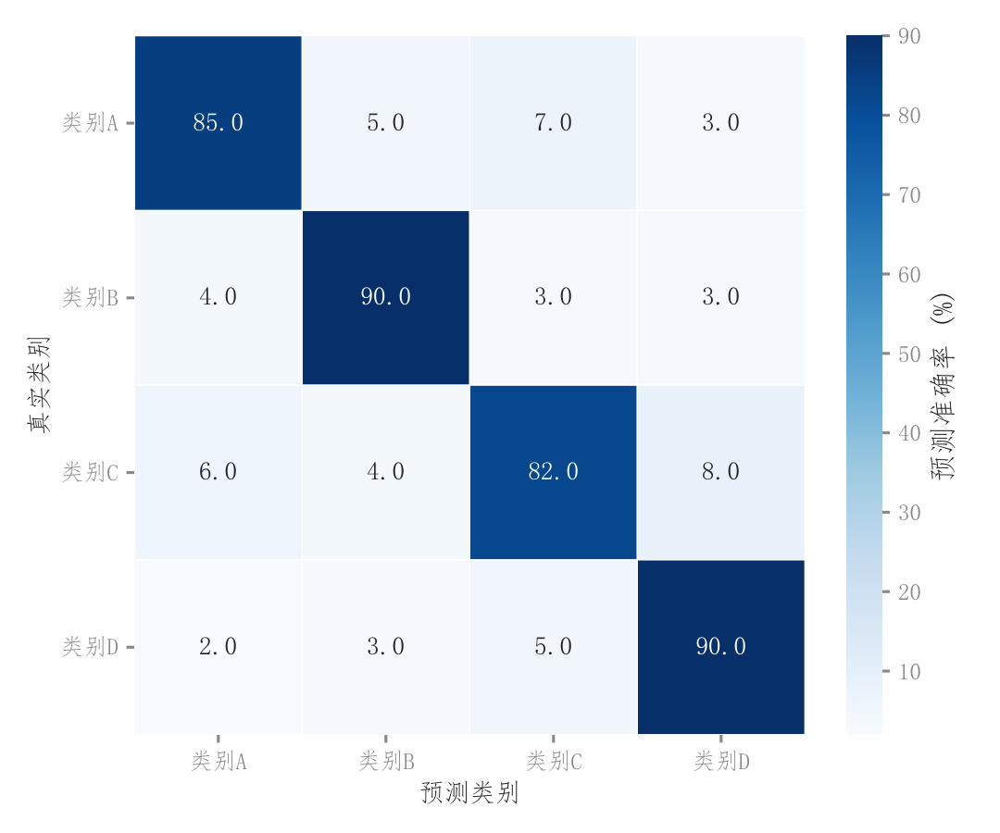

# 089 · 分类混淆矩阵

ID：`competition.confusion_matrix`

用途：哪些类别识别正确，哪些类别互相混淆？

标签：预测、诊断、矩阵

别名：confusion matrix、混淆矩阵

## 数据要求

- 真实×预测类别计数或归一化矩阵

## 组合结构

方形矩阵；侧色条

## 视觉特点

- 蓝色连续色阶
- 格内数字
- 对比色文字

## 适配注意

必须明确行列方向和归一化单位；区别于误命名的academic.confusion_matrix雨云图。

## 预览

## 来源与核对

原名称：混淆矩阵热力图
原始代码：[查看](../sources/competition.confusion_matrix/original.html)
预览范围：首个主要Python示例
已查看对应预览并核对主要绘图和数据代码；卡片不是统计有效性认证。

<!-- fidelity:start -->
## 源码保真要点

以当前完整配方源码为底稿；下列行号指向解释预览的快照。数据适配不应顺手删掉这些视觉结构。

### 百分比矩阵与数值标签

- 保留重点：保留连续非负色阶、格内数字、白格线和色条，行列类别对应清晰。
- 可适配：类别数量、归一化方式和色相可变；数字单位与色条一致，不误把行归一化当全局占比。
- 源码：[L11–13](../sources/competition.confusion_matrix/original.html#L11)

按现有审图流程对照实际输出；有疑问时可用[源码差异提示](../../template-fidelity.md)。
