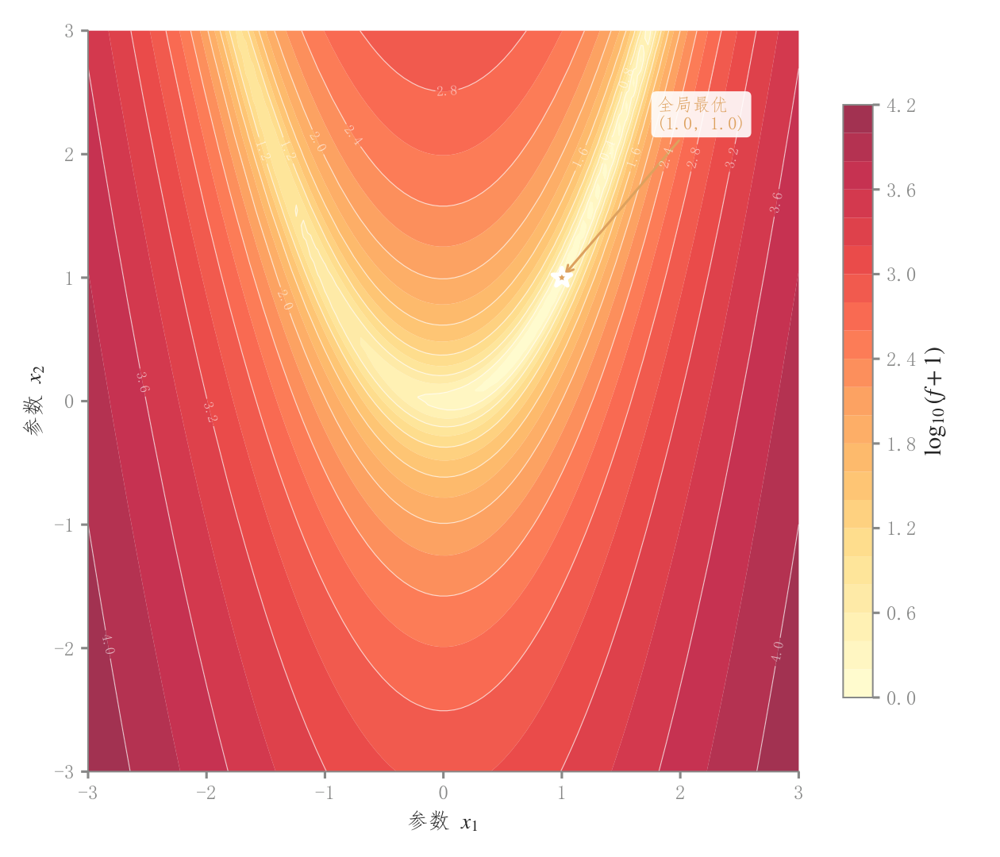

# 093 · 双参数目标等高线

ID：`competition.contour`

用途：双参数空间中的低谷和优选区域在哪里？

标签：优化、矩阵

别名：双参数目标等高线

## 数据要求

- 规则参数网格与目标值

## 组合结构

俯视填色等高线；等值线和色条

## 视觉特点

- 暖色连续层次
- 最优星号
- 目标对数显示

## 适配注意

当前色条使用目标变换，需明确log口径；比3D曲面更便于定位二维参数范围。

## 预览

## 来源与核对

原名称：等高线图（双变量参数搜索）
原始代码：[查看](../sources/competition.contour/original.html)
预览范围：首个主要Python示例
已查看对应预览并核对主要绘图和数据代码；卡片不是统计有效性认证。

## 相近候选

- [三维目标曲面与底部等高线](competition.surface_3d.md)
- [三维损失地形与优化轨迹](academic.feature_importance.md)
- [二维可行性分区与约束边界](competition.feasible_region.md)

<!-- fidelity:start -->
## 源码保真要点

以当前完整配方源码为底稿；下列行号指向解释预览的快照。数据适配不应顺手删掉这些视觉结构。

### 填色面与白色等值线

- 保留重点：保留连续填色、叠加白色等值线、最优白边星号和准确色条，不只留下纯色块。
- 可适配：网格、连续色相和等值级数可变；最优点和变换标签由实际目标函数确定。
- 源码：[L11–11](../sources/competition.contour/original.html#L11) · [L12–12](../sources/competition.contour/original.html#L12) · [L16–16](../sources/competition.contour/original.html#L16) · [L22–22](../sources/competition.contour/original.html#L22)

按现有审图流程对照实际输出；有疑问时可用[源码差异提示](../../template-fidelity.md)。
