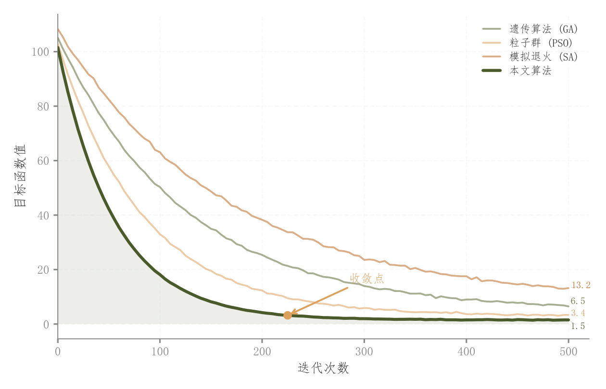

# 080 · 多算法迭代收敛曲线

ID：`competition.convergence`

用途：算法收敛速度及最终目标值怎样？

标签：优化、趋势、比较

别名：多算法迭代收敛曲线

## 数据要求

- 各算法迭代序列与目标值

## 组合结构

多折线单面板；终点标签

## 视觉特点

- 主算法加粗
- 主曲线下浅填充
- 收敛位置箭头

## 适配注意

示例迭代为模拟曲线；阴影是强调，不是重复试验CI；收敛标准需按任务定义。

## 预览

## 来源与核对

原名称：收敛曲线对比图
原始代码：[查看](../sources/competition.convergence/original.html)
预览范围：首个主要Python示例
已查看对应预览并核对主要绘图和数据代码；卡片不是统计有效性认证。

## 相近候选

- [Dolan–Moré性能剖面](advanced.performance_profile.md)
- [损失准确率双轴与学习率插图](academic.training_curves.md)

<!-- fidelity:start -->
## 源码保真要点

以当前完整配方源码为底稿；下列行号指向解释预览的快照。数据适配不应顺手删掉这些视觉结构。

### 主曲线浅填充与收敛标记

- 保留重点：保留主算法加粗、曲线下浅填充、终点标签和有依据的收敛位置箭头，不能只画等粗裸线。
- 可适配：迭代次数、目标值与收敛判据按实际优化过程更新；曲线下填充不是不确定性区间。
- 源码：[L22–22](../sources/competition.convergence/original.html#L22) · [L31–31](../sources/competition.convergence/original.html#L31) · [L36–39](../sources/competition.convergence/original.html#L36)

按现有审图流程对照实际输出；有疑问时可用[源码差异提示](../../template-fidelity.md)。
