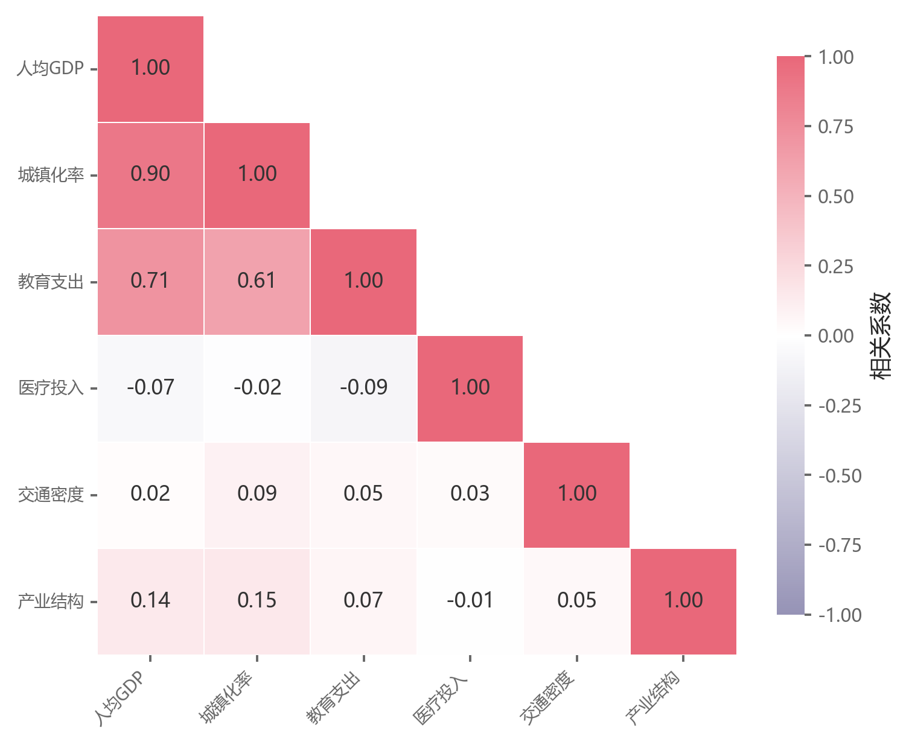

# 091 · 简洁下三角相关矩阵

ID：`competition.correlation_matrix`

用途：多个变量的相关方向与强度怎样？

标签：关联、矩阵

别名：简洁下三角相关矩阵

## 数据要求

- 样本×变量或已计算相关矩阵

## 组合结构

下三角方格；右侧色条

## 视觉特点

- 红蓝发散色
- 白色遮罩
- 格内数值

## 适配注意

无树状图、无散点和分布；相关矩阵不能替代原始数据的成对关系图。

## 预览

## 来源与核对

原名称：相关性矩阵图（下三角 + 数值标注）
原始代码：[查看](../sources/competition.correlation_matrix/original.html)
预览范围：首个主要Python示例
已查看对应预览并核对主要绘图和数据代码；卡片不是统计有效性认证。

## 相近候选

- [分布与Pearson成对关系矩阵](advanced.pair_plot.md)
- [残差小提琴与Pearson完整组合](template.sem_violin_pearson.md)
- [相关显著性热图与顶部树](empirical.correlation_heatmap.md)
- [带双侧树状图的下三角相关矩阵](basic.heatmap.md)

<!-- fidelity:start -->
## 源码保真要点

以当前完整配方源码为底稿；下列行号指向解释预览的快照。数据适配不应顺手删掉这些视觉结构。

### 带遮罩的发散相关矩阵

- 保留重点：保留下三角遮罩、零中心的发散色阶、格内数值及细白分界。Pearson 相关仍按 −1 到 1 解释。
- 可适配：变量数、排序和数字精度可变；色相按当前配色指导选择合适的发散色图，不锁死快照中的 RdBu_r。
- 源码：[L13–20](../sources/competition.correlation_matrix/original.html#L13)

### 色条与格子含义一致

- 保留重点：保留相关系数色条及清晰的行列变量对应，遮罩处不伪装成零相关。
- 可适配：色条尺寸、标签位置随版面调整；换成其他指标时重新确定色阶含义，不沿用相关系数解释。
- 源码：[L16–21](../sources/competition.correlation_matrix/original.html#L16)

按现有审图流程对照实际输出；有疑问时可用[源码差异提示](../../template-fidelity.md)。

## 项目配色

热图默认读取项目配色；连续插值、中性色、透明度及数据归一化保留，数值文字按实际底色选择对比色。
