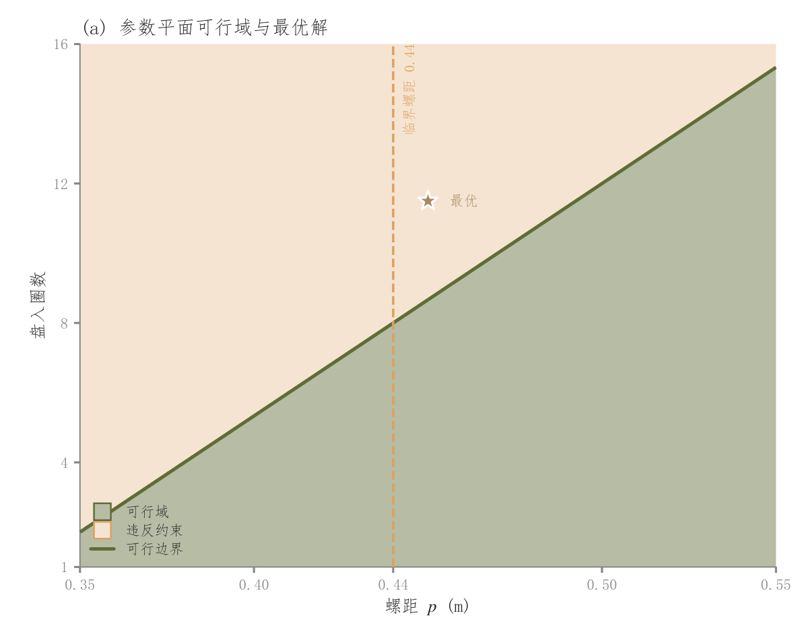

# 107 · 二维可行性分区与约束边界

ID：`competition.feasible_region`

用途：哪些参数组合满足约束，解位于何处？

标签：优化、矩阵

别名：二维可行性分区与约束边界

## 数据要求

- 二维参数网格
- 可行掩码或约束裕度
- 已验证的解

## 组合结构

两类填色；零裕度边界；参考阈值线

## 视觉特点

- 浅色可行与违反区域
- 星形解点

## 适配注意

原示例标注最优点的裕度为-1.7，落在违反区；参考位置不能直接复用为真实可行解。

## 预览

## 来源与核对

原名称：可行域图（约束满足分区 + 边界 + 最优点）
原始代码：[查看](../sources/competition.feasible_region/original.html)
预览范围：首个主要Python示例
已查看对应预览并核对主要绘图和数据代码；卡片不是统计有效性认证。

## 相近候选

- [三维目标曲面与底部等高线](competition.surface_3d.md)
- [三维损失地形与优化轨迹](academic.feature_importance.md)
- [双参数目标等高线](competition.contour.md)

<!-- fidelity:start -->
## 源码保真要点

以当前完整配方源码为底稿；下列行号指向解释预览的快照。数据适配不应顺手删掉这些视觉结构。

### 两类区域与边界

- 保留重点：保留离散的可行/违反区、零裕度边界、临界参考和最优星号；不能把两类区域改成无含义连续渐变。
- 可适配：约束、网格、边界、最优点和临界值据实计算，浅色端点可随配色适配。
- 源码：[L20–20](../sources/competition.feasible_region/original.html#L20) · [L22–22](../sources/competition.feasible_region/original.html#L22) · [L26–26](../sources/competition.feasible_region/original.html#L26) · [L32–33](../sources/competition.feasible_region/original.html#L32)

按现有审图流程对照实际输出；有疑问时可用[源码差异提示](../../template-fidelity.md)。
