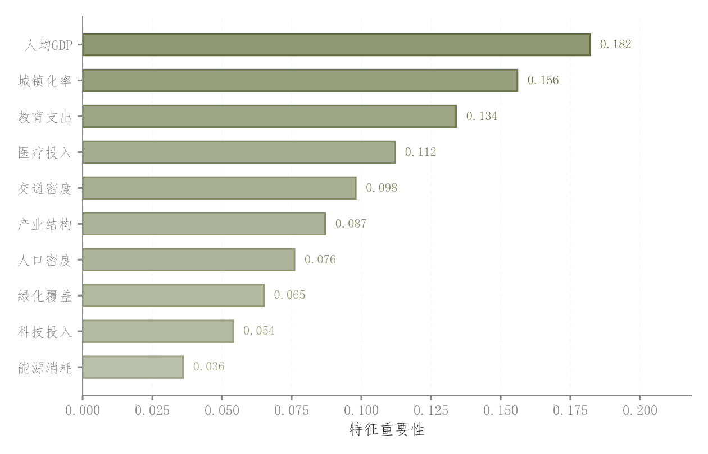

# 088 · 特征贡献排序条形

ID：`competition.feature_importance`

用途：哪些特征的重要性较高？

标签：解释、排序

别名：特征贡献排序条形

## 数据要求

- 特征名和非负重要性分数

## 组合结构

降序横条；条末数值

## 视觉特点

- 由重要性驱动的条间深浅
- 深描边
- 整洁排序

## 适配注意

不是条内渐变，也不是SHAP方向图；重要性计算方法需明确。

## 预览

## 来源与核对

原名称：特征重要性排序图（渐变柱状图）
原始代码：[查看](../sources/competition.feature_importance/original.html)
预览范围：首个主要Python示例
已查看对应预览并核对主要绘图和数据代码；卡片不是统计有效性认证。

<!-- fidelity:start -->
## 源码保真要点

以当前完整配方源码为底稿；下列行号指向解释预览的快照。数据适配不应顺手删掉这些视觉结构。

### 随重要性变化的浅条

- 保留重点：保留降序横条的数值驱动深浅、_lighten 浅填充和深描边、末端数值，不能全条同色同亮度。
- 可适配：特征数量、重要性定义及排序据实更新，色相可变但保留强弱层次。
- 源码：[L20–21](../sources/competition.feature_importance/original.html#L20) · [L22–23](../sources/competition.feature_importance/original.html#L22)

按现有审图流程对照实际输出；有疑问时可用[源码差异提示](../../template-fidelity.md)。
