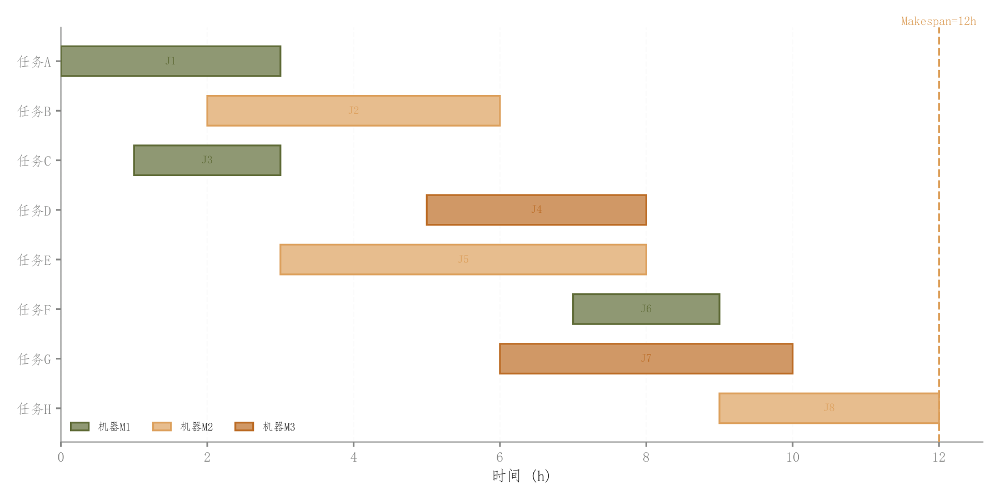

# 094 · 任务排程甘特图

ID：`competition.gantt`

用途：任务何时开始结束，哪些时间段重叠？

标签：时间、调度

别名：任务排程甘特图

## 数据要求

- 任务名称
- 开始时间
- 持续时间
- 资源组

## 组合结构

任务行×时间；水平时间条

## 视觉特点

- 浅填充深描边
- 任务时长文字
- 总完工时间竖线

## 适配注意

模板展示排程，不执行约束求解；重叠是否冲突依赖资源与任务规则。

## 预览

## 来源与核对

原名称：甘特图（彩色条形 + 原色边框 + 里程碑/排斥标记）
原始代码：[查看](../sources/competition.gantt/original.html)
预览范围：首个主要Python示例
已查看对应预览并核对主要绘图和数据代码；卡片不是统计有效性认证。

<!-- fidelity:start -->
## 源码保真要点

以当前完整配方源码为底稿；下列行号指向解释预览的快照。数据适配不应顺手删掉这些视觉结构。

### 浅任务条与完工线

- 保留重点：保留任务起止形成的水平条、浅填充深边、任务标签和总完工竖线。
- 可适配：任务数、时长、排序和时间单位可变，完工时间重算；任务条位置由真实起止决定。
- 源码：[L18–19](../sources/competition.gantt/original.html#L18) · [L20–21](../sources/competition.gantt/original.html#L20) · [L25–25](../sources/competition.gantt/original.html#L25) · [L28–30](../sources/competition.gantt/original.html#L28)

按现有审图流程对照实际输出；有疑问时可用[源码差异提示](../../template-fidelity.md)。
