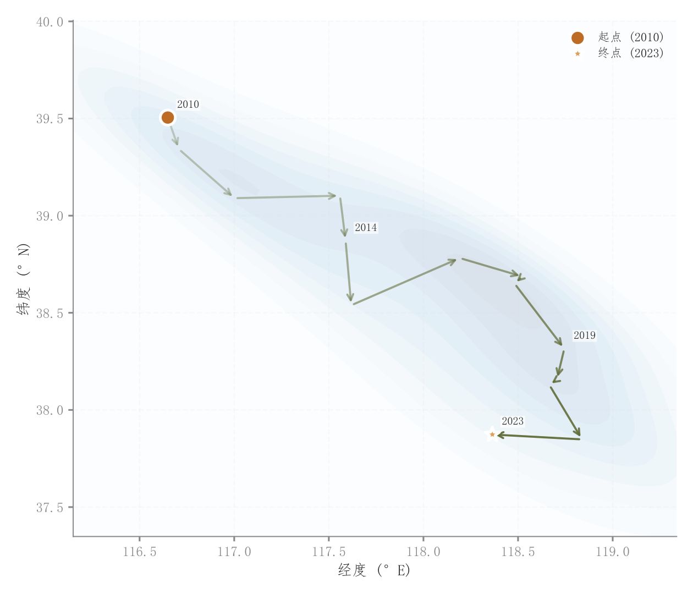

# 092 · 空间重心时间轨迹

ID：`competition.gravity_migration`

用途：空间重心如何随年份迁移？

标签：空间、时间、趋势

别名：空间重心时间轨迹

## 数据要求

- 按时间排序的二维地理坐标
- 可由加权地点计算重心

## 组合结构

空间平面上的有向折线；背景密度

## 视觉特点

- 起止点突出
- 沿途年份
- 浅KDE背景

## 适配注意

代码直接模拟坐标，未计算加权重心；经纬度距离不应直接当作等距米制距离。

## 预览

## 来源与核对

原名称：重心迁移轨迹图
原始代码：[查看](../sources/competition.gravity_migration/original.html)
预览范围：首个主要Python示例
已查看对应预览并核对主要绘图和数据代码；卡片不是统计有效性认证。

<!-- fidelity:start -->
## 源码保真要点

以当前完整配方源码为底稿；下列行号指向解释预览的快照。数据适配不应顺手删掉这些视觉结构。

### 迁移箭头与密度浅底

- 保留重点：保留浅 KDE 背景、有向阶段路径、起止重点点与沿途年份，不能去掉方向信息。
- 可适配：由实际位置或重心计算顺序和密度，坐标范围、箭头偏移与标签避让可调。
- 源码：[L20–20](../sources/competition.gravity_migration/original.html#L20) · [L25–26](../sources/competition.gravity_migration/original.html#L25) · [L29–29](../sources/competition.gravity_migration/original.html#L29) · [L30–30](../sources/competition.gravity_migration/original.html#L30) · [L34–35](../sources/competition.gravity_migration/original.html#L34)

按现有审图流程对照实际输出；有疑问时可用[源码差异提示](../../template-fidelity.md)。
