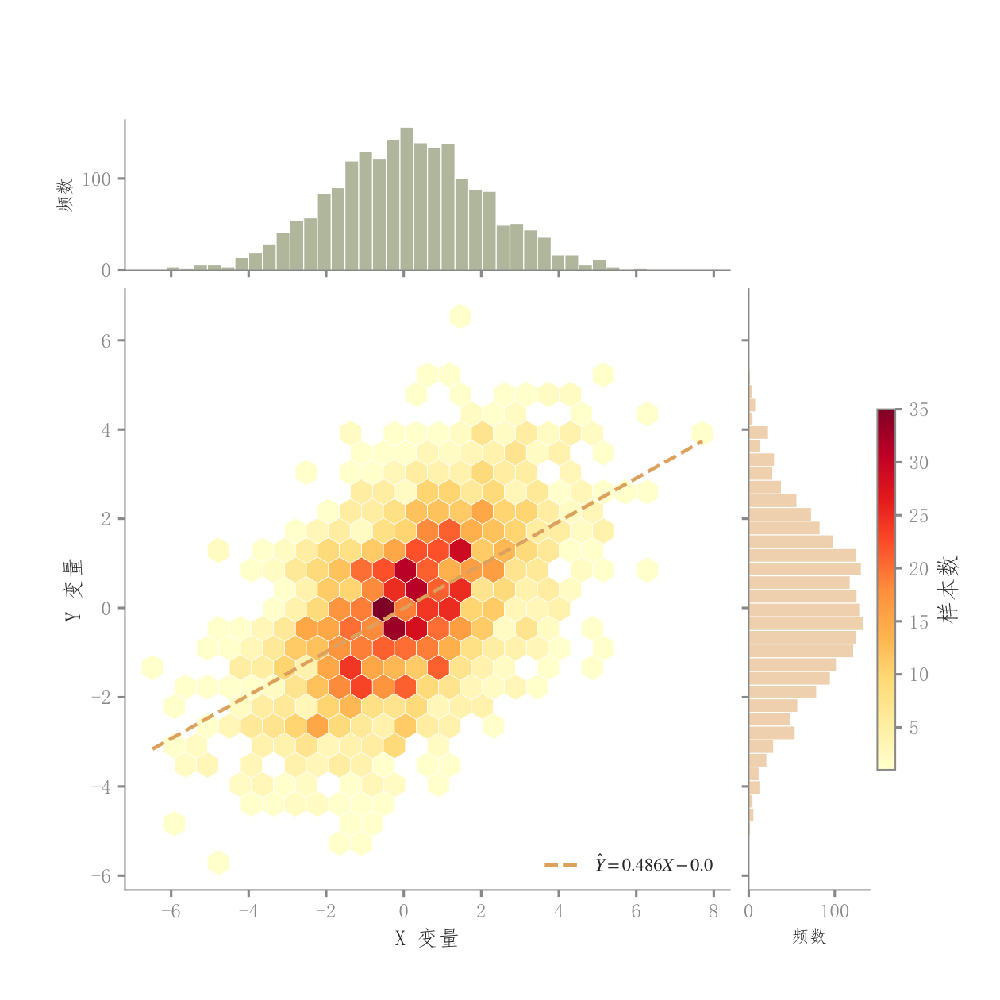

# 103 · 六边形计数与边际直方

ID：`competition.hexbin_joint`

用途：大量重叠样本的联合频数怎样分布？

标签：关联、分布、组合

别名：hexbin、jointplot、边际直方图

## 数据要求

- 逐样本配对连续x、y

## 组合结构

主图六边形分箱；上与右边际直方

## 视觉特点

- 黄红频数色阶
- 回归虚线
- 浅色边际

## 适配注意

适合大量点重叠；格子大小改变颗粒感；颜色是计数不是第三个实测变量。

## 预览

## 来源与核对

原名称：Hexbin 联合分布图（六边形分箱 + 边际直方图）
原始代码：[查看](../sources/competition.hexbin_joint/original.html)
预览范围：首个主要Python示例
已查看对应预览并核对主要绘图和数据代码；卡片不是统计有效性认证。

## 相近候选

- [散点回归与双边际密度](basic.scatter_regression.md)
- [简洁回归散点与边际KDE](competition.scatter_regression_marginals.md)
- [二维密度与双边际联合图](competition.kde_joint.md)
- [气泡与双边际密度](competition.bubble_joint.md)
- [二维密度等高线与散点](competition.bubble_kde.md)

<!-- fidelity:start -->
## 源码保真要点

以当前完整配方源码为底稿；下列行号指向解释预览的快照。数据适配不应顺手删掉这些视觉结构。

### 计数六边形与双边际

- 保留重点：保留主图六边形计数、格边分隔、回归虚线和顶部/右侧浅直方；不能直接换普通散点。
- 可适配：分箱粒度、边际分箱、回归和连续色相可变；色条仍对应计数或明确的新统计量。
- 源码：[L20–20](../sources/competition.hexbin_joint/original.html#L20) · [L25–26](../sources/competition.hexbin_joint/original.html#L25) · [L31–31](../sources/competition.hexbin_joint/original.html#L31) · [L36–37](../sources/competition.hexbin_joint/original.html#L36) · [L44–44](../sources/competition.hexbin_joint/original.html#L44)

按现有审图流程对照实际输出；有疑问时可用[源码差异提示](../../template-fidelity.md)。
