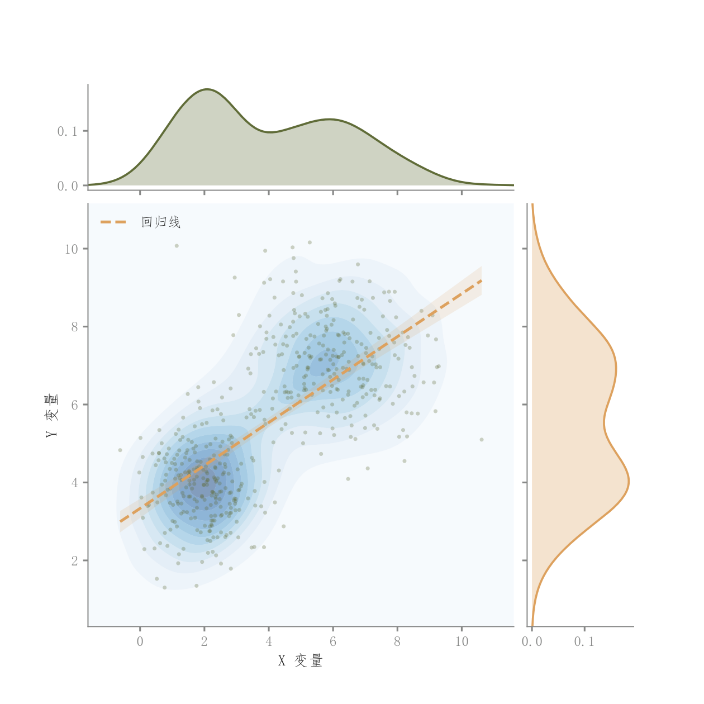

# 104 · 二维密度与双边际联合图

ID：`competition.kde_joint`

用途：联合密度的峰形与各变量边际分布怎样？

标签：关联、分布、组合

别名：KDE jointplot、联合分布、边际密度

## 数据要求

- 逐样本配对连续x、y

## 组合结构

主图散点和KDE；上方x密度；右方y密度

## 视觉特点

- 蓝色浅密度背景
- 回归虚线
- 透明边际面积

## 适配注意

多峰数据的全局回归可能掩盖分群关系；区别于以频数为主的hexbin_joint。

## 预览

## 来源与核对

原名称：KDE 热力联合分布图（散点 + 热力图 + 边际密度）
原始代码：[查看](../sources/competition.kde_joint/original.html)
预览范围：首个主要Python示例
已查看对应预览并核对主要绘图和数据代码；卡片不是统计有效性认证。

## 相近候选

- [散点回归与双边际密度](basic.scatter_regression.md)
- [简洁回归散点与边际KDE](competition.scatter_regression_marginals.md)
- [六边形计数与边际直方](competition.hexbin_joint.md)
- [气泡与双边际密度](competition.bubble_joint.md)
- [二维密度等高线与散点](competition.bubble_kde.md)

<!-- fidelity:start -->
## 源码保真要点

以当前完整配方源码为底稿；下列行号指向解释预览的快照。数据适配不应顺手删掉这些视觉结构。

### 主图密度加回归带与边际

- 保留重点：保留主图浅密度、透明散点、回归虚线与真实区间，以及两侧浅填充密度和轮廓。
- 可适配：样本、带宽、区间计算、连续色相和边际比例可变，三个轴的数据范围需对应。
- 源码：[L26–26](../sources/competition.kde_joint/original.html#L26) · [L27–27](../sources/competition.kde_joint/original.html#L27) · [L34–34](../sources/competition.kde_joint/original.html#L34) · [L35–36](../sources/competition.kde_joint/original.html#L35) · [L43–43](../sources/competition.kde_joint/original.html#L43) · [L44–44](../sources/competition.kde_joint/original.html#L44) · [L49–49](../sources/competition.kde_joint/original.html#L49) · [L50–50](../sources/competition.kde_joint/original.html#L50)

按现有审图流程对照实际输出；有疑问时可用[源码差异提示](../../template-fidelity.md)。
