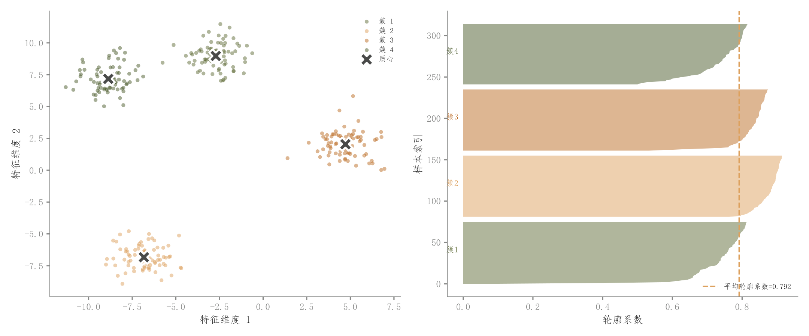

# 102 · 聚类分布与轮廓系数双面板

ID：`competition.kmeans`

用途：簇在哪里，样本归属质量怎样？

标签：聚类、诊断、组合

别名：聚类分布与轮廓系数双面板

## 数据要求

- 连续特征
- 聚类设置或标签
- 轮廓系数

## 组合结构

左二维聚类散点；右按簇轮廓系数条带

## 视觉特点

- 类色对应
- 中心叉号
- 平均轮廓分界

## 适配注意

需要真实聚类及指标；二维坐标应说明是原特征还是投影，示例簇较清晰不保证真实数据如此。

## 预览

## 来源与核对

原名称：K-means 聚类双面板图（外部轮廓 + 内部散点）
原始代码：[查看](../sources/competition.kmeans/original.html)
预览范围：首个主要Python示例
已查看对应预览并核对主要绘图和数据代码；卡片不是统计有效性认证。

## 相近候选

- [三维分组点云与凸包投影](academic.benchmark_table.md)
- [三维分组散点](competition.cluster_3d.md)
- [二维嵌入簇与密度轮廓](academic.tsne_umap.md)

<!-- fidelity:start -->
## 源码保真要点

以当前完整配方源码为底稿；下列行号指向解释预览的快照。数据适配不应顺手删掉这些视觉结构。

### 聚类点与轮廓系数双面板

- 保留重点：保留左侧类色点云与白边中心叉号、右侧同类色轮廓系数填带及均值参考。
- 可适配：簇数、模型和投影坐标可变，轮廓系数按真实聚类计算，双面板类别颜色一致。
- 源码：[L19–20](../sources/competition.kmeans/original.html#L19) · [L21–22](../sources/competition.kmeans/original.html#L21) · [L34–35](../sources/competition.kmeans/original.html#L34) · [L40–41](../sources/competition.kmeans/original.html#L40)

按现有审图流程对照实际输出；有疑问时可用[源码差异提示](../../template-fidelity.md)。
