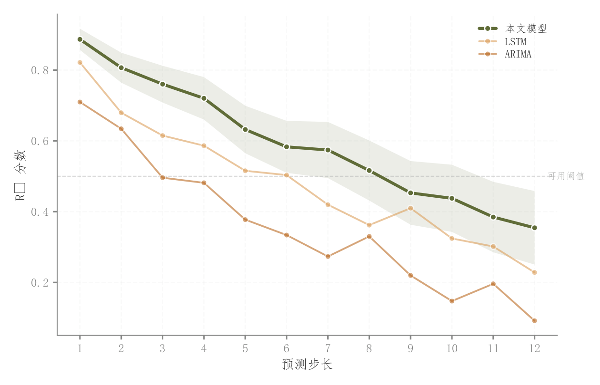

# 096 · 多步预测性能衰减

ID：`competition.multistep_decay`

用途：预测步长增长时模型何时失去可用精度？

标签：预测、趋势、比较

别名：多步预测性能衰减

## 数据要求

- 步长×模型的评价分数

## 组合结构

多折线；阈值参考

## 视觉特点

- 主模型粗线和浅带
- 不同点形
- 阈值标签

## 适配注意

示例色带宽度为演示，非实测不确定性；阈值依据应用需求设定。

## 预览

## 来源与核对

原名称：多步预测衰减图
原始代码：[查看](../sources/competition.multistep_decay/original.html)
预览范围：首个主要Python示例
已查看对应预览并核对主要绘图和数据代码；卡片不是统计有效性认证。

## 相近候选

- [预测步长性能与模型跨度](empirical.multistep_decay.md)

<!-- fidelity:start -->
## 源码保真要点

以当前完整配方源码为底稿；下列行号指向解释预览的快照。数据适配不应顺手删掉这些视觉结构。

### 主模型区间与阈值

- 保留重点：保留主模型粗线和浅带、白边点与阈值参考；源码的浅带围绕单个主模型，不是所有方法跨度。
- 可适配：步数、方法、阈值和区间重新确定，没有重复结果时不复制示例 std。
- 源码：[L20–21](../sources/competition.multistep_decay/original.html#L20) · [L24–24](../sources/competition.multistep_decay/original.html#L24) · [L27–27](../sources/competition.multistep_decay/original.html#L27)

按现有审图流程对照实际输出；有疑问时可用[源码差异提示](../../template-fidelity.md)。
