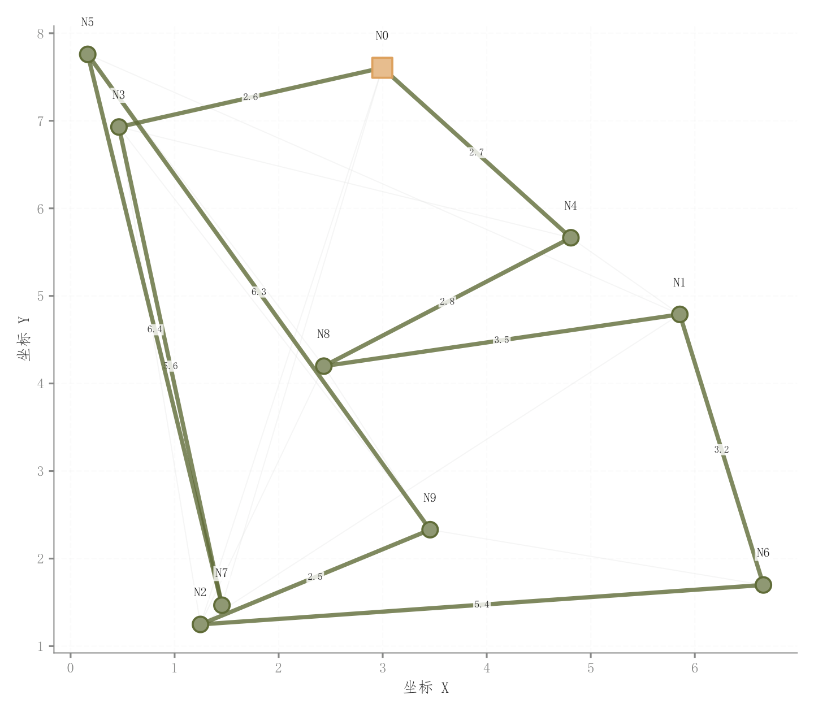

# 095 · 网络路线与节点布局

ID：`competition.network_path`

用途：路径经过哪些节点，怎样区别于其他边？

标签：网络、优化、空间

别名：网络路线与节点布局

## 数据要求

- 节点二维坐标
- 边集
- 实际求得的路径

## 组合结构

平面节点与边；高亮路线

## 视觉特点

- 背景边很浅
- 主路线加粗
- 节点白边和编号

## 适配注意

示例图与路线为模拟，不能据此声称最短或可行；路径边必须存在于真实图中。

## 预览

## 来源与核对

原名称：网络路径/路线规划图（彩色边 + 原色边框节点）
原始代码：[查看](../sources/competition.network_path/original.html)
预览范围：首个主要Python示例
已查看对应预览并核对主要绘图和数据代码；卡片不是统计有效性认证。

<!-- fidelity:start -->
## 源码保真要点

以当前完整配方源码为底稿；下列行号指向解释预览的快照。数据适配不应顺手删掉这些视觉结构。

### 浅背景网络与主路线

- 保留重点：保留浅背景边、加粗主路线、节点形状/描边与标签，路径必须从背景网络中突出。
- 可适配：节点位置、权重、路线和端点身份据实替换，文字可避让，不为构图伪造连接。
- 源码：[L26–27](../sources/competition.network_path/original.html#L26) · [L32–33](../sources/competition.network_path/original.html#L32) · [L37–38](../sources/competition.network_path/original.html#L37) · [L46–47](../sources/competition.network_path/original.html#L46) · [L48–50](../sources/competition.network_path/original.html#L48)

按现有审图流程对照实际输出；有疑问时可用[源码差异提示](../../template-fidelity.md)。
