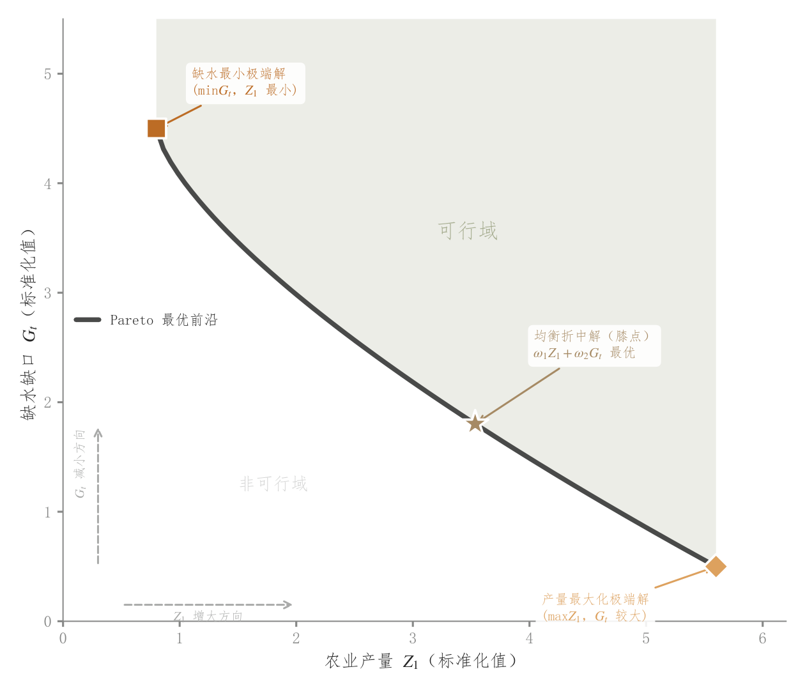

# 082 · 双目标Pareto前沿与代表解

ID：`competition.pareto_front`

用途：两个冲突目标怎样权衡，折中解在哪里？

标签：优化、比较

别名：双目标Pareto前沿与代表解

## 数据要求

- 已筛选非支配解
- 目标方向
- 可选可行域和代表解

## 组合结构

二维前沿线；一侧区域填充

## 视觉特点

- 极端解与折中星号
- 方向箭头
- 区域标签

## 适配注意

示例前沿及可行域为解析演示；不能仅凭一条前沿把一侧全判为可行。

## 预览

## 来源与核对

原名称：Pareto 前沿图
原始代码：[查看](../sources/competition.pareto_front/original.html)
预览范围：首个主要Python示例
已查看对应预览并核对主要绘图和数据代码；卡片不是统计有效性认证。

<!-- fidelity:start -->
## 源码保真要点

以当前完整配方源码为底稿；下列行号指向解释预览的快照。数据适配不应顺手删掉这些视觉结构。

### 前沿与代表解的视觉层次

- 保留重点：保留前沿粗线、极端解与折中星号、短引线注释及方向箭头；区域浅填充仅在区域含义有数据或模型依据时保留。
- 可适配：目标方向、实际前沿和折中判据按真实结果计算。离散候选只证明观测点的非支配关系；不能将平滑或直线插值的一侧声称为可行域。若展示离散最小化点集的支配区域，应按实际点构成的阶梯边界绘制；不需区域时省略对应填充与标签，保留前沿和代表解。
- 源码：[L14–14](../sources/competition.pareto_front/original.html#L14) · [L19–19](../sources/competition.pareto_front/original.html#L19) · [L23–24](../sources/competition.pareto_front/original.html#L23) · [L25–31](../sources/competition.pareto_front/original.html#L25) · [L35–36](../sources/competition.pareto_front/original.html#L35) · [L37–43](../sources/competition.pareto_front/original.html#L37) · [L46–47](../sources/competition.pareto_front/original.html#L46) · [L48–54](../sources/competition.pareto_front/original.html#L48) · [L57–58](../sources/competition.pareto_front/original.html#L57) · [L60–61](../sources/competition.pareto_front/original.html#L60)

按现有审图流程对照实际输出；有疑问时可用[源码差异提示](../../template-fidelity.md)。
