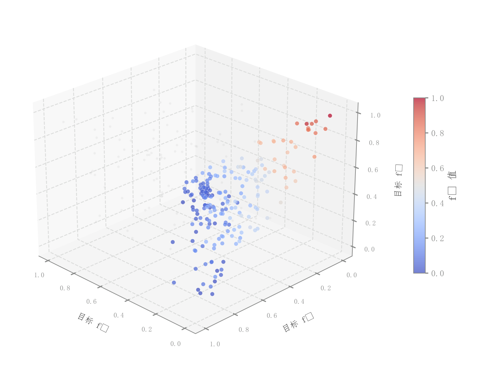

# 098 · 三目标候选解与前沿散点

ID：`competition.pareto_surface_3d`

用途：三目标解集的折中关系和分布怎样？

标签：三维、优化、比较

别名：3d Pareto scatter、三目标解集

## 数据要求

- 三目标值
- 非支配筛选结果
- 其他候选解

## 组合结构

3D散点；背景候选与前景解集

## 视觉特点

- 灰色透明背景点
- 第三目标连续着色
- 白点边

## 适配注意

名称称曲面，代码实际没有曲面网格；示例标签为生成分组，未验证所有点的非支配性。

## 预览

## 来源与核对

原名称：3D Pareto 曲面（三目标优化）
原始代码：[查看](../sources/competition.pareto_surface_3d/original.html)
预览范围：首个主要Python示例
已查看对应预览并核对主要绘图和数据代码；卡片不是统计有效性认证。

<!-- fidelity:start -->
## 源码保真要点

以当前完整配方源码为底稿；下列行号指向解释预览的快照。数据适配不应顺手删掉这些视觉结构。

### 背景候选与前沿点云

- 保留重点：保留灰色透明背景点、前景解集的连续着色和白边；实际源码是点云，不强制加出不存在的曲面。
- 可适配：实际候选集与非支配集、三目标范围和视角可变，连续色条仍解释所映射的目标。
- 源码：[L23–23](../sources/competition.pareto_surface_3d/original.html#L23) · [L25–26](../sources/competition.pareto_surface_3d/original.html#L25) · [L33–33](../sources/competition.pareto_surface_3d/original.html#L33)

按现有审图流程对照实际输出；有疑问时可用[源码差异提示](../../template-fidelity.md)。
