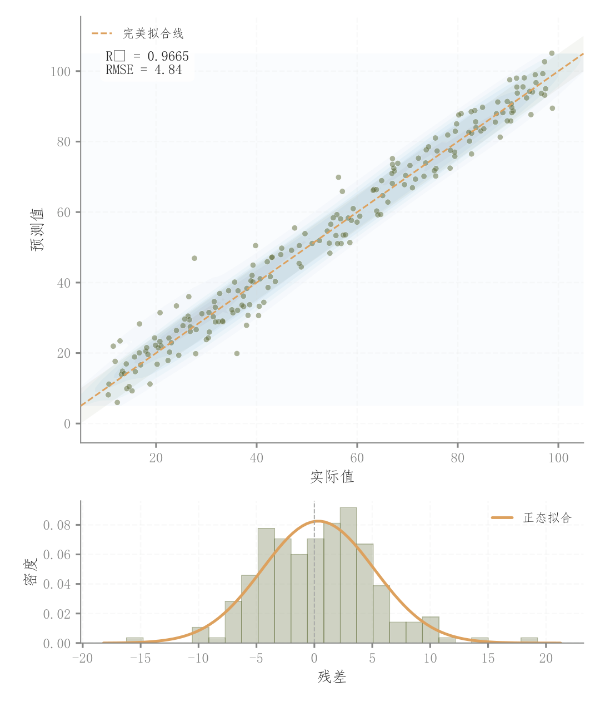

# 083 · 预测对实际散点与下方残差分布

ID：`competition.prediction_actual`

用途：预测是否贴近真实值，残差是否偏斜？

标签：预测、误差、组合

别名：预测对实际散点与下方残差分布

## 数据要求

- 逐样本真实值与预测值

## 组合结构

上方真实—预测散点；下方残差直方

## 视觉特点

- 密度背景
- 理想线
- 拟合指标
- 残差正态参考

## 适配注意

上方横轴不是时间；下方分布是残差而非边际分布；比较需使用同一测试集。

## 预览

## 来源与核对

原名称：预测值 vs 实际值（上下放大 + 残差分布图）
原始代码：[查看](../sources/competition.prediction_actual/original.html)
预览范围：首个主要Python示例
已查看对应预览并核对主要绘图和数据代码；卡片不是统计有效性认证。

## 相近候选

- [历史与预测分位数扇形图](advanced.fan.md)
- [时序预测与误差侧分布](empirical.prediction_ci.md)
- [概率校准与预测概率分布](advanced.calibration.md)

<!-- fidelity:start -->
## 源码保真要点

以当前完整配方源码为底稿；下列行号指向解释预览的快照。数据适配不应顺手删掉这些视觉结构。

### 预测散点与下方误差

- 保留重点：保留浅密度背景、透明白边散点、理想对角线及下方残差直方/正态参考，不仅保留拟合指标。
- 可适配：真实和预测值配对，残差与指标重算；对角线周围区域须说明含义，不当成已计算 CI。
- 源码：[L20–20](../sources/competition.prediction_actual/original.html#L20) · [L21–21](../sources/competition.prediction_actual/original.html#L21) · [L22–22](../sources/competition.prediction_actual/original.html#L22) · [L23–23](../sources/competition.prediction_actual/original.html#L23) · [L31–31](../sources/competition.prediction_actual/original.html#L31) · [L33–33](../sources/competition.prediction_actual/original.html#L33)

按现有审图流程对照实际输出；有疑问时可用[源码差异提示](../../template-fidelity.md)。
