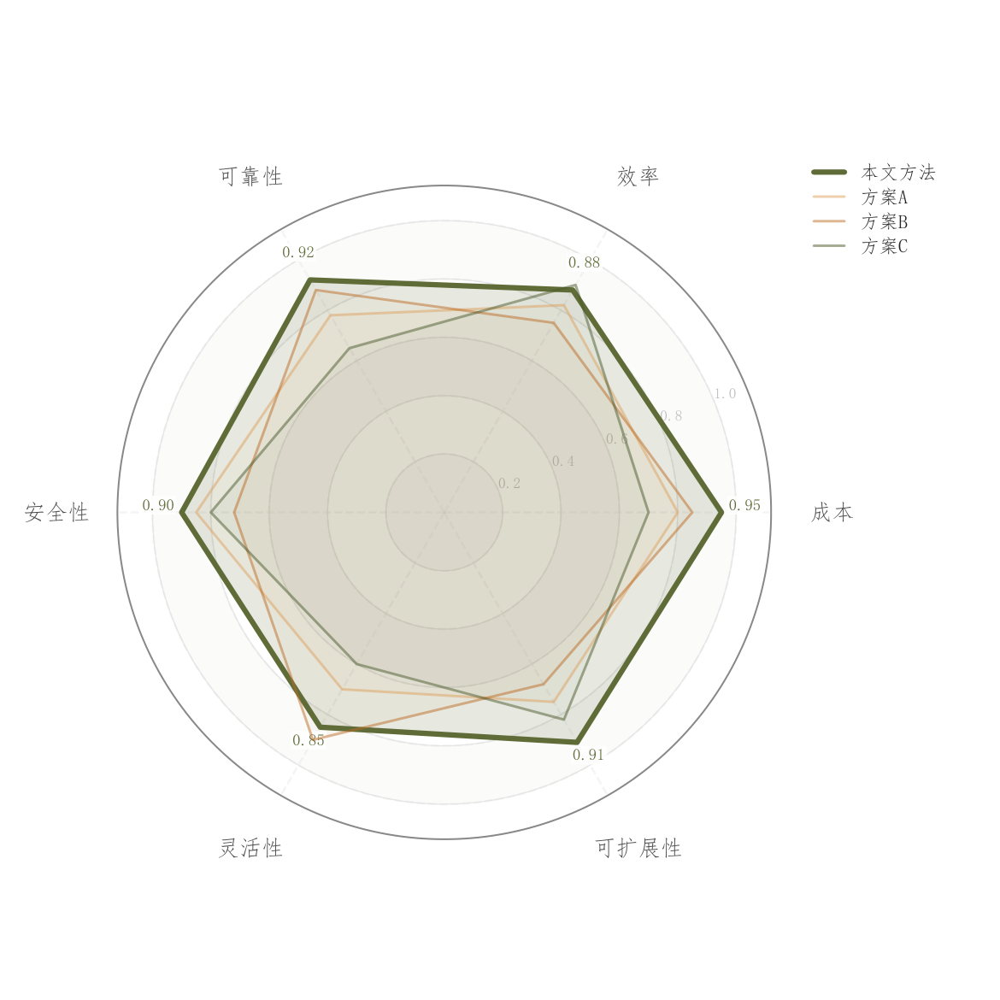

# 084 · 多方案雷达与交替背景环

ID：`competition.radar`

用途：方案在各维度的长短板怎样分布？

标签：比较、多维

别名：多方案雷达与交替背景环

## 数据要求

- 方案×归一化指标
- 标签与高低优方向

## 组合结构

极坐标闭合多边形

## 视觉特点

- 透明叠加面
- 主方案突出
- 交替浅色环
- 外侧数值

## 适配注意

背景为交替同色环而非连续渐变；成本等指标需先统一优劣方向。

## 预览

## 来源与核对

原名称：雷达图（多方案对比 + 渐变背景 + 多维度覆盖 + 顶部数值标注）
原始代码：[查看](../sources/competition.radar/original.html)
预览范围：首个主要Python示例
已查看对应预览并核对主要绘图和数据代码；卡片不是统计有效性认证。

## 相近候选

- [归一化多指标雷达对比](academic.latent_interpolation.md)
- [多指标平行坐标](advanced.parallel_coordinates.md)
- [多指标方法排名热力图](advanced.method_heatmap.md)
- [多模型多指标预测热力排名](empirical.prediction_accuracy_heatmap.md)

<!-- fidelity:start -->
## 源码保真要点

以当前完整配方源码为底稿；下列行号指向解释预览的快照。数据适配不应顺手删掉这些视觉结构。

### 极坐标面与交替浅环

- 保留重点：保留闭合透明叠面、主次线宽、交替浅环与外侧读数，不以实色面遮掉其他方案。
- 可适配：指标数量与归一化、主方案和标签位置可变，不同量纲先确定可比规则。
- 源码：[L27–27](../sources/competition.radar/original.html#L27) · [L28–28](../sources/competition.radar/original.html#L28) · [L42–42](../sources/competition.radar/original.html#L42) · [L43–43](../sources/competition.radar/original.html#L43)

按现有审图流程对照实际输出；有疑问时可用[源码差异提示](../../template-fidelity.md)。
