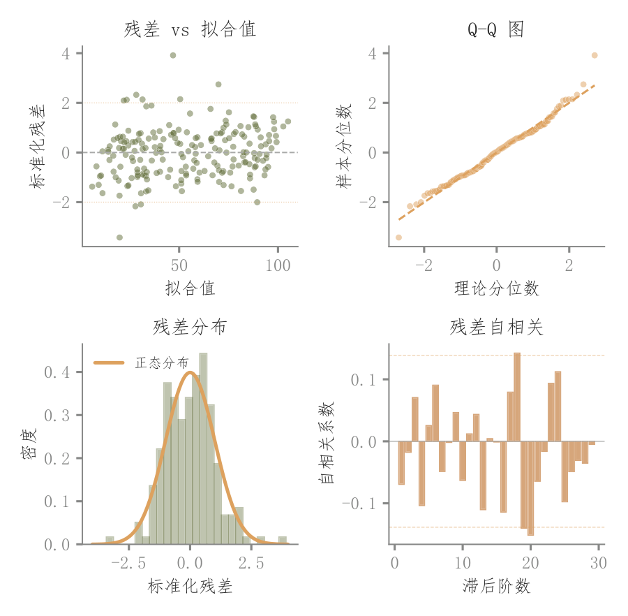

# 087 · 残差分布与自相关四面板

ID：`competition.residual_diagnostics`

用途：残差是否有偏、非正态或时间相关？

标签：诊断、误差、组合

别名：残差分布与自相关四面板

## 数据要求

- 真实值与预测值
- 有顺序的残差

## 组合结构

2×2：残差拟合、Q-Q、标准化分布、ACF

## 视觉特点

- 透明散点
- 正态参考
- 自相关条形

## 适配注意

ACF需要有意义的样本顺序；区别于实证版右下Cook距离；普通独立样本顺序不代表时间。

## 预览

## 来源与核对

原名称：残差诊断四合一图
原始代码：[查看](../sources/competition.residual_diagnostics/original.html)
预览范围：首个主要Python示例
已查看对应预览并核对主要绘图和数据代码；卡片不是统计有效性认证。

## 相近候选

- [回归残差四面板与影响点](empirical.residual_diagnostics.md)

<!-- fidelity:start -->
## 源码保真要点

以当前完整配方源码为底稿；下列行号指向解释预览的快照。数据适配不应顺手删掉这些视觉结构。

### 残差四面板与自相关

- 保留重点：保留残差—拟合、Q-Q、标准化分布和 ACF 的四种读法、透明点及各自参考线。
- 可适配：残差和自相关按拟合结果计算，滞后数和版面可变；本模板第四格不是 Cook 距离。
- 源码：[L15–15](../sources/competition.residual_diagnostics/original.html#L15) · [L16–16](../sources/competition.residual_diagnostics/original.html#L16) · [L17–17](../sources/competition.residual_diagnostics/original.html#L17) · [L18–18](../sources/competition.residual_diagnostics/original.html#L18) · [L24–24](../sources/competition.residual_diagnostics/original.html#L24) · [L25–25](../sources/competition.residual_diagnostics/original.html#L25) · [L30–30](../sources/competition.residual_diagnostics/original.html#L30) · [L32–32](../sources/competition.residual_diagnostics/original.html#L32) · [L39–39](../sources/competition.residual_diagnostics/original.html#L39) · [L41–41](../sources/competition.residual_diagnostics/original.html#L41) · [L42–42](../sources/competition.residual_diagnostics/original.html#L42) · [L43–43](../sources/competition.residual_diagnostics/original.html#L43)

按现有审图流程对照实际输出；有疑问时可用[源码差异提示](../../template-fidelity.md)。
