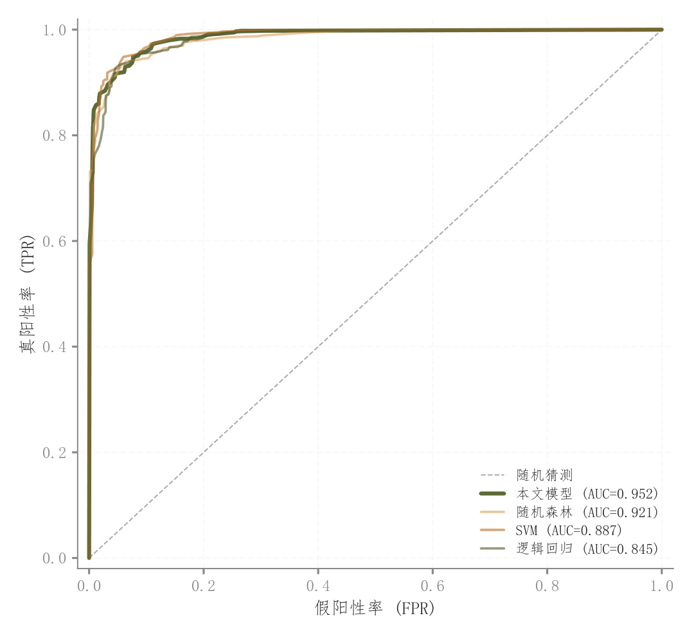

# 090 · 多模型ROC曲线

ID：`competition.roc`

用途：不同阈值下敏感度与误报率怎样权衡？

标签：预测、比较、诊断

别名：多模型ROC曲线

## 数据要求

- 真实二分类标签和预测分数，或已计算FPR/TPR

## 组合结构

单位方形内多条ROC；对角随机参考

## 视觉特点

- 模型线宽与透明度主次
- 图例AUC

## 适配注意

示例ROC坐标随机合成且图例AUC为设定值，正式应用必须从同一预测计算。

## 预览

## 来源与核对

原名称：ROC 曲线 + AUC 对比
原始代码：[查看](../sources/competition.roc/original.html)
预览范围：首个主要Python示例
已查看对应预览并核对主要绘图和数据代码；卡片不是统计有效性认证。

<!-- fidelity:start -->
## 源码保真要点

以当前完整配方源码为底稿；下列行号指向解释预览的快照。数据适配不应顺手删掉这些视觉结构。

### ROC主次线与随机参照

- 保留重点：保留模型曲线的线宽/透明度主次、随机对角参照与 AUC 图例；这个主示例没有各模型不同点形。
- 可适配：曲线点和 AUC 来自真实分数与标签，方法数和图例位置可变，不虚构锯齿或平滑改变统计。
- 源码：[L15–15](../sources/competition.roc/original.html#L15) · [L21–21](../sources/competition.roc/original.html#L21) · [L25–25](../sources/competition.roc/original.html#L25)

按现有审图流程对照实际输出；有疑问时可用[源码差异提示](../../template-fidelity.md)。
