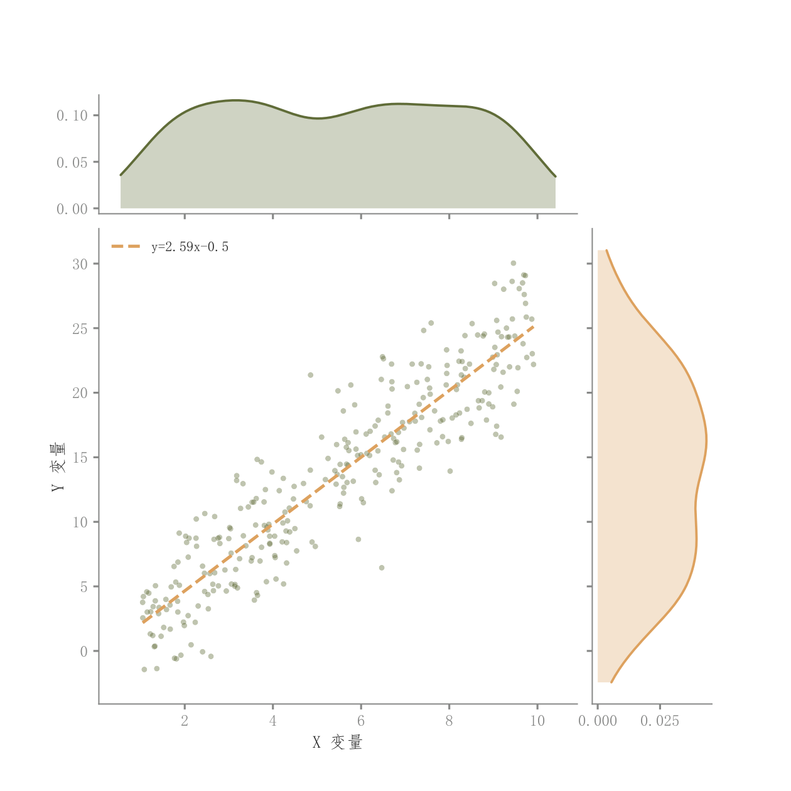

# 105 · 简洁回归散点与边际KDE

ID：`competition.scatter_regression_marginals`

用途：两个变量的线性关系与单变量分布怎样？

标签：关联、分布、组合

别名：jointplot、回归与边际密度

## 数据要求

- 配对x、y原始样本

## 组合结构

中央散点回归；上方与右方密度

## 视觉特点

- 稀疏透明点
- 回归虚线
- 浅填充边际

## 适配注意

主图不含basic.scatter_regression的二维密度背景和回归带；适合希望主图更简洁时。

## 预览

## 来源与核对

原名称：散点 + 回归 + 边际密度图（通用版）
原始代码：[查看](../sources/competition.scatter_regression_marginals/original.html)
预览范围：首个主要Python示例
已查看对应预览并核对主要绘图和数据代码；卡片不是统计有效性认证。

## 相近候选

- [散点回归与双边际密度](basic.scatter_regression.md)
- [二维密度与双边际联合图](competition.kde_joint.md)
- [六边形计数与边际直方](competition.hexbin_joint.md)
- [气泡与双边际密度](competition.bubble_joint.md)
- [二维密度等高线与散点](competition.bubble_kde.md)

<!-- fidelity:start -->
## 源码保真要点

以当前完整配方源码为底稿；下列行号指向解释预览的快照。数据适配不应顺手删掉这些视觉结构。

### 稀疏透明点与浅边际

- 保留重点：保留透明白边散点、回归虚线、顶部及右侧浅密度与深轮廓；此模板没有中央 KDE 填色。
- 可适配：配对样本、回归、带宽和边际尺寸可变，不能为了统一风格增加无依据的统计图层。
- 源码：[L20–20](../sources/competition.scatter_regression_marginals/original.html#L20) · [L23–23](../sources/competition.scatter_regression_marginals/original.html#L23) · [L29–29](../sources/competition.scatter_regression_marginals/original.html#L29) · [L30–30](../sources/competition.scatter_regression_marginals/original.html#L30) · [L35–35](../sources/competition.scatter_regression_marginals/original.html#L35) · [L36–36](../sources/competition.scatter_regression_marginals/original.html#L36)

按现有审图流程对照实际输出；有疑问时可用[源码差异提示](../../template-fidelity.md)。
