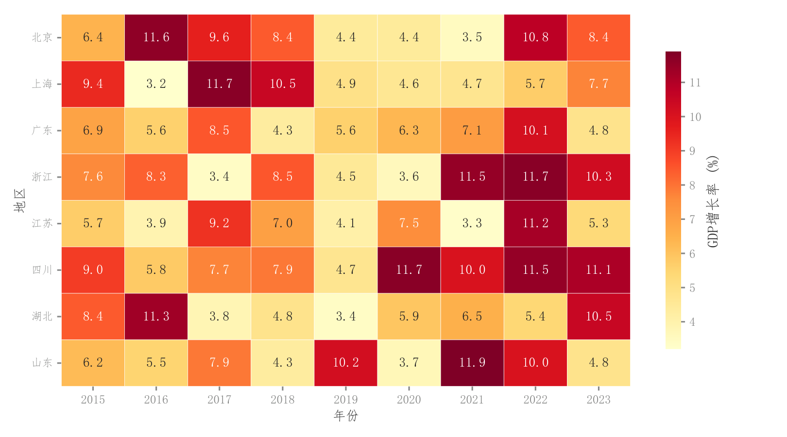

# 097 · 地区年份数值热力表

ID：`competition.spatiotemporal_heatmap`

用途：各地区不同年份的高低值和变化模式怎样？

标签：空间、时间、矩阵

别名：地区年份数值热力表

## 数据要求

- 地区×年份数值矩阵

## 组合结构

地区行；年份列；侧色条

## 视觉特点

- 黄红色阶
- 格内原值
- 白格线

## 适配注意

这是离散地区列表而非连续空间坐标；跨地区同一指标应使用同一色标。

## 预览

## 来源与核对

原名称：时空经济热力图
原始代码：[查看](../sources/competition.spatiotemporal_heatmap/original.html)
预览范围：首个主要Python示例
已查看对应预览并核对主要绘图和数据代码；卡片不是统计有效性认证。

<!-- fidelity:start -->
## 源码保真要点

以当前完整配方源码为底稿；下列行号指向解释预览的快照。数据适配不应顺手删掉这些视觉结构。

### 地区时间格与原值

- 保留重点：保留地区行、年份列的顺序、连续色阶、原值注释、细白格线及有单位的色条。
- 可适配：时段、地区数量、数值精度和连续色相可变，不因检索分组而任意打乱时间。
- 源码：[L13–16](../sources/competition.spatiotemporal_heatmap/original.html#L13)

按现有审图流程对照实际输出；有疑问时可用[源码差异提示](../../template-fidelity.md)。
