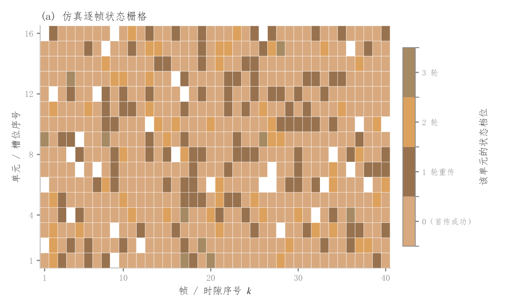

# 108 · 离散状态时间栅格

ID：`competition.state_grid`

用途：单元状态随帧或时隙如何切换？

标签：时间、矩阵、仿真

别名：state grid、状态矩阵、时隙仿真

## 数据要求

- 单元×时间的离散状态编码矩阵
- 类别解释

## 组合结构

每单元一行；每时隙一列

## 视觉特点

- 离散色块
- 细白格线
- 状态色条

## 适配注意

颜色编码类别或等级，不适合连续插值；状态0可能代表成功而非无数据。

## 预览

## 来源与核对

原名称：离散状态栅格图（仿真逐帧/逐时隙状态热图）
原始代码：[查看](../sources/competition.state_grid/original.html)
预览范围：首个主要Python示例
已查看对应预览并核对主要绘图和数据代码；卡片不是统计有效性认证。

<!-- fidelity:start -->
## 源码保真要点

以当前完整配方源码为底稿；下列行号指向解释预览的快照。数据适配不应顺手删掉这些视觉结构。

### 离散状态与格子边界

- 保留重点：保留离散状态颜色、细白格线、整数状态色条及缺失遮罩，不用连续渐变暗示状态之间存在插值。
- 可适配：单元、时隙、状态数量和类别颜色可变；每个色条标签对应同一离散状态。
- 源码：[L23–25](../sources/competition.state_grid/original.html#L23) · [L27–27](../sources/competition.state_grid/original.html#L27)

按现有审图流程对照实际输出；有疑问时可用[源码差异提示](../../template-fidelity.md)。
