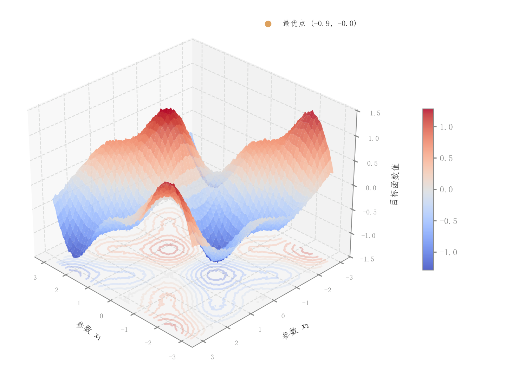

# 085 · 三维目标曲面与底部等高线

ID：`competition.surface_3d`

用途：两个参数改变时目标地形和极值在哪里？

标签：三维、优化

别名：三维目标曲面与底部等高线

## 数据要求

- 二维规则网格
- 每点目标值

## 组合结构

3D连续曲面；底部投影；侧色条

## 视觉特点

- 红蓝连续色阶
- 半透明曲面
- 最优点标记

## 适配注意

原代码最优点来自网格极小值；稀疏散点不直接等于连续曲面，插值需有依据。

## 预览

## 来源与核对

原名称：3D 曲面图（目标函数地形）
原始代码：[查看](../sources/competition.surface_3d/original.html)
预览范围：首个主要Python示例
已查看对应预览并核对主要绘图和数据代码；卡片不是统计有效性认证。

## 相近候选

- [三维损失地形与优化轨迹](academic.feature_importance.md)
- [双参数目标等高线](competition.contour.md)
- [二维可行性分区与约束边界](competition.feasible_region.md)

<!-- fidelity:start -->
## 源码保真要点

以当前完整配方源码为底稿；下列行号指向解释预览的快照。数据适配不应顺手删掉这些视觉结构。

### 半透明曲面与底部投影

- 保留重点：保留 alpha=0.85 曲面、alpha=0.3 底部等高线投影及对应色条，三者用一致的连续数值映射。
- 可适配：函数或网格、连续色相、等高线级数、底部偏移和视角可调；投影不与曲面重叠遮挡。
- 源码：[L11–12](../sources/competition.surface_3d/original.html#L11) · [L24–24](../sources/competition.surface_3d/original.html#L24)

### 真实极值与空间视角

- 保留重点：保留白边极值点和可读的三轴空间关系，不为了美化把极值硬放到模板坐标。
- 可适配：按目标选最大或最小，重新计算标记；相机、轴范围与标签间距可随数据调整。
- 源码：[L15–23](../sources/competition.surface_3d/original.html#L15)

按现有审图流程对照实际输出；有疑问时可用[源码差异提示](../../template-fidelity.md)。
