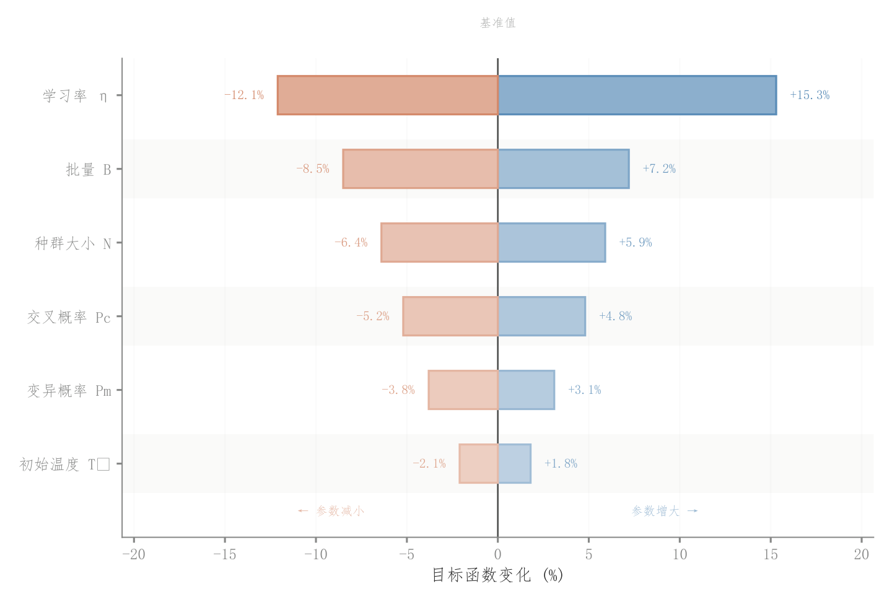

# 081 · 参数上下扰动龙卷风图

ID：`competition.tornado`

用途：哪些参数的扰动对结果影响最大？

标签：优化、比较、变化

别名：参数上下扰动龙卷风图

## 数据要求

- 各参数低值和高值扰动相对基准的影响

## 组合结构

按影响跨度排序的正负横条

## 视觉特点

- 两方向配色
- 随幅度变化的浅填充
- 交替行底色

## 适配注意

各参数扰动范围要可比；一侧影响不一定均为正或负，应以真实符号绘制。

## 预览

## 来源与核对

原名称：灵敏度图（Tornado / Sensitivity）
原始代码：[查看](../sources/competition.tornado/original.html)
预览范围：首个主要Python示例
已查看对应预览并核对主要绘图和数据代码；卡片不是统计有效性认证。

<!-- fidelity:start -->
## 源码保真要点

以当前完整配方源码为底稿；下列行号指向解释预览的快照。数据适配不应顺手删掉这些视觉结构。

### 双向幅度与浅深映射

- 保留重点：保留按影响跨度排序的两向条形、随幅度变化的浅填色和深描边，以及浅交替行。
- 可适配：正负扰动和影响幅度据实计算，可调条宽和文本间距，不能固定所有条的深浅。
- 源码：[L34–34](../sources/competition.tornado/original.html#L34) · [L44–45](../sources/competition.tornado/original.html#L44) · [L48–49](../sources/competition.tornado/original.html#L48) · [L59–61](../sources/competition.tornado/original.html#L59) · [L63–65](../sources/competition.tornado/original.html#L63) · [L69–72](../sources/competition.tornado/original.html#L69) · [L75–76](../sources/competition.tornado/original.html#L75) · [L77–78](../sources/competition.tornado/original.html#L77)

按现有审图流程对照实际输出；有疑问时可用[源码差异提示](../../template-fidelity.md)。
