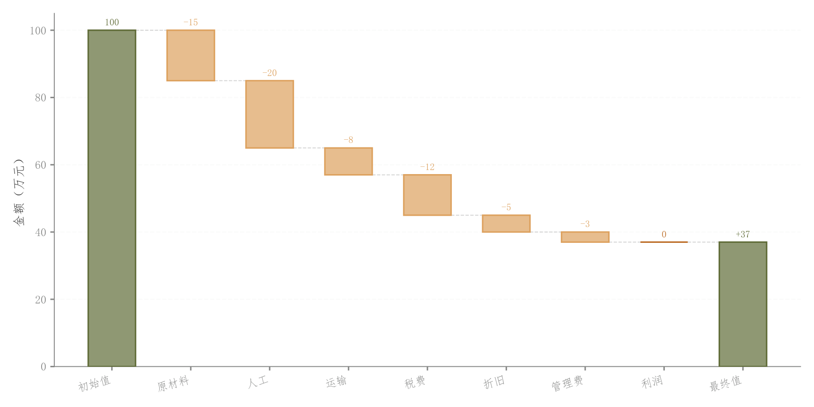

# 099 · 增减贡献浮动柱瀑布

ID：`competition.waterfall`

用途：初始值经过各项增减如何形成最终值？

标签：变化、组成

别名：增减贡献浮动柱瀑布

## 数据要求

- 初始总量
- 各步骤带符号增量

## 组合结构

首尾总量柱；中间浮动增减柱；连接线

## 视觉特点

- 浅填充深边
- 顶部变化值
- 累计高度

## 适配注意

区别于advanced.waterfall的阶梯色带；需核对首尾总量与步骤加总一致。

## 预览

## 来源与核对

原名称：瀑布图（彩色渐变柱图 + 连接线 + 顶部数值标注）
原始代码：[查看](../sources/competition.waterfall/original.html)
预览范围：首个主要Python示例
已查看对应预览并核对主要绘图和数据代码；卡片不是统计有效性认证。

## 相近候选

- [累计增益阶梯与贡献色带](advanced.waterfall.md)
- [消融配置柱状比较](academic.ablation.md)
- [相对基线发散条形](advanced.diverging_bar.md)

<!-- fidelity:start -->
## 源码保真要点

以当前完整配方源码为底稿；下列行号指向解释预览的快照。数据适配不应顺手删掉这些视觉结构。

### 浮动增减柱和累计连接

- 保留重点：保留首尾总量柱、中间浮动柱的 bottom、浅填充深边和累计水平连接线；不是 advanced.waterfall 的阶梯带。
- 可适配：增减项、总量和基线据实重算，颜色跟随增减含义，标签位置可调。
- 源码：[L36–37](../sources/competition.waterfall/original.html#L36) · [L42–43](../sources/competition.waterfall/original.html#L42) · [L47–48](../sources/competition.waterfall/original.html#L47)

按现有审图流程对照实际输出；有疑问时可用[源码差异提示](../../template-fidelity.md)。
