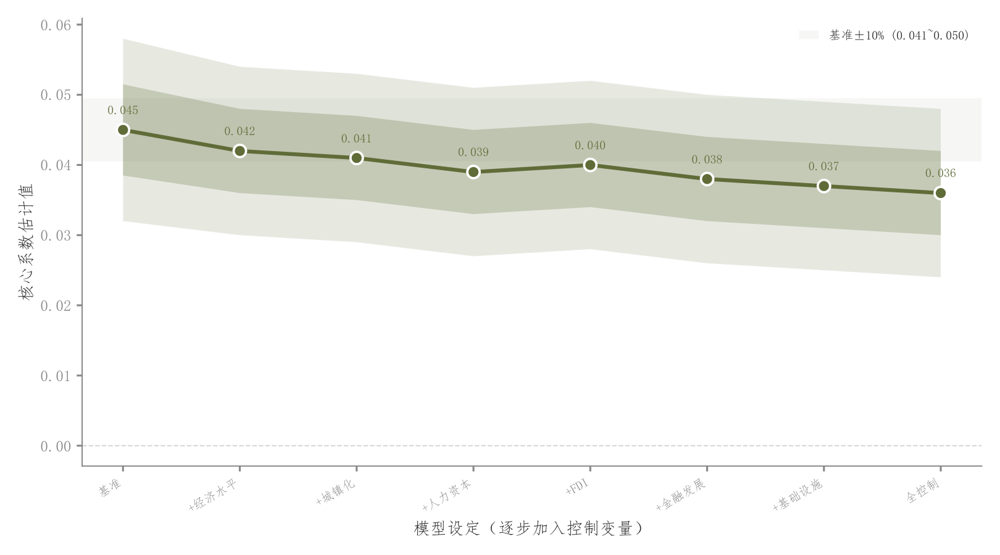

# 065 · 逐步控制的系数稳定性

ID：`empirical.coefficient_stability`

用途：加入控制变量后核心系数是否稳定？

标签：解释、误差、趋势

别名：逐步控制的系数稳定性

## 数据要求

- 按设定顺序的系数、CI及设定名

## 组合结构

系数折线；零线和基准范围

## 视觉特点

- 两层嵌套透明CI
- 基准±10%浅带
- 数值标签

## 适配注意

不是连续渐变；基准范围是参考而非CI；模型顺序具有含义，不是时间变化。

## 预览

## 来源与核对

原名称：Coefficient Stability Plot (Sequential Control Variable Addition)
原始代码：[查看](../sources/empirical.coefficient_stability/original.html)
预览范围：首个主要Python示例
已查看对应预览并核对主要绘图和数据代码；卡片不是统计有效性认证。

<!-- fidelity:start -->
## 源码保真要点

以当前完整配方源码为底稿；下列行号指向解释预览的快照。数据适配不应顺手删掉这些视觉结构。

### 两层系数带和基准区

- 保留重点：保留系数路径、两层嵌套浅带与基准范围背景，分清置信区间和基准容差。
- 可适配：控制变量序列、系数和区间重新计算；容差按任务设定，标签可避让。
- 源码：[L16–16](../sources/empirical.coefficient_stability/original.html#L16) · [L17–19](../sources/empirical.coefficient_stability/original.html#L17) · [L22–23](../sources/empirical.coefficient_stability/original.html#L22) · [L35–36](../sources/empirical.coefficient_stability/original.html#L35)

按现有审图流程对照实际输出；有疑问时可用[源码差异提示](../../template-fidelity.md)。
