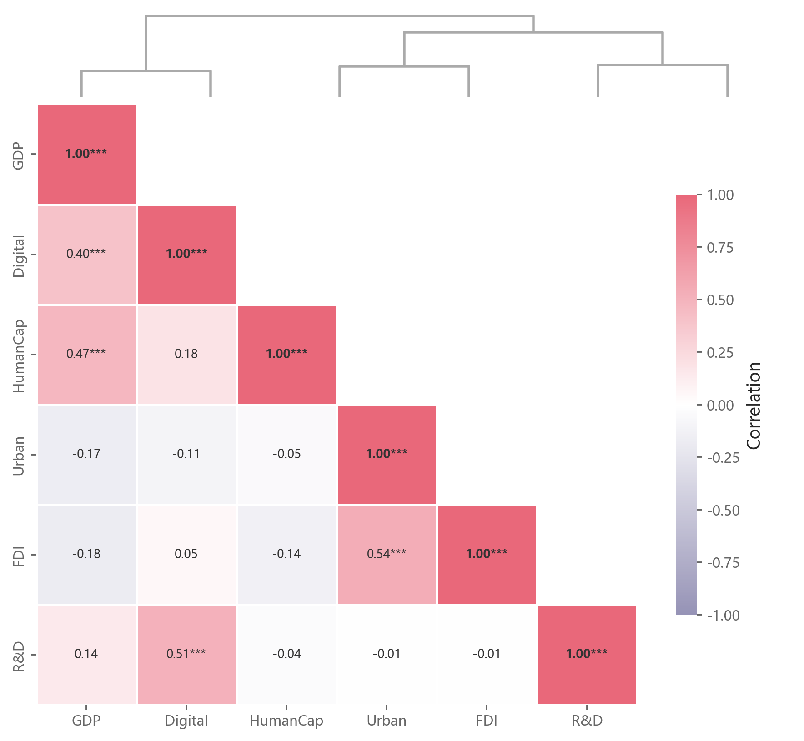

# 051 · 相关显著性热图与顶部树

ID：`empirical.correlation_heatmap`

用途：变量相关方向、强度及显著性如何？

标签：关联、矩阵、聚类

别名：相关显著性热图与顶部树

## 数据要求

- 原始变量样本
- 或相关矩阵与对应p值

## 组合结构

下三角矩阵；顶部树；侧色条

## 视觉特点

- 红蓝色阶
- 相关数值与星号
- 白格线

## 适配注意

当前树的顺序没有同步重排矩阵；聚类输入定义需核对；显著性来自样本而非相关数值本身。

## 预览

## 来源与核对

原名称：Correlation Heatmap
原始代码：[查看](../sources/empirical.correlation_heatmap/original.html)
预览范围：首个主要Python示例
已查看对应预览并核对主要绘图和数据代码；卡片不是统计有效性认证。

## 相近候选

- [分布与Pearson成对关系矩阵](advanced.pair_plot.md)
- [残差小提琴与Pearson完整组合](template.sem_violin_pearson.md)
- [简洁下三角相关矩阵](competition.correlation_matrix.md)
- [带双侧树状图的下三角相关矩阵](basic.heatmap.md)

<!-- fidelity:start -->
## 源码保真要点

以当前完整配方源码为底稿；下列行号指向解释预览的快照。数据适配不应顺手删掉这些视觉结构。

### 聚类下三角与统计标签

- 保留重点：保留聚类顺序、下三角遮罩、相关数值/星号、白格线和发散色阶；自绘注释不能因 annot=False 被漏掉。
- 可适配：变量、顺序、色相和精度可变；星号需有有效检验，不从相关大小直接生成。
- 源码：[L25–25](../sources/empirical.correlation_heatmap/original.html#L25) · [L31–33](../sources/empirical.correlation_heatmap/original.html#L31) · [L42–43](../sources/empirical.correlation_heatmap/original.html#L42)

按现有审图流程对照实际输出；有疑问时可用[源码差异提示](../../template-fidelity.md)。

## 项目配色

热图默认读取项目配色；连续插值、中性色、透明度及数据归一化保留，数值文字按实际底色选择对比色。
