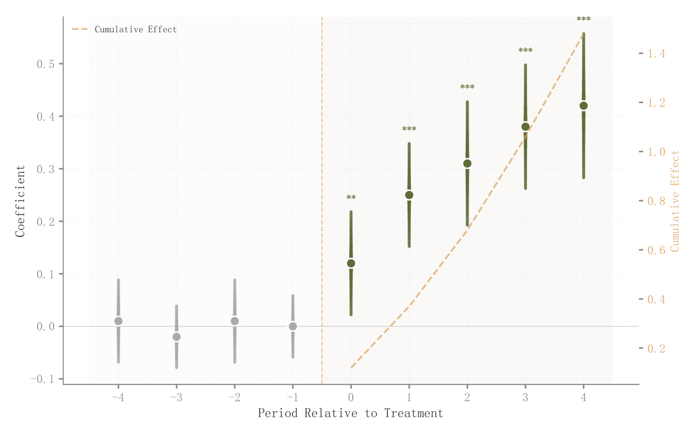

# 049 · 事件时间系数与累计效应

ID：`empirical.event_study`

用途：干预动态效应出现于何时并持续多久？

标签：因果、趋势、误差

别名：event study、动态DID、事件研究

## 数据要求

- 事件期系数和标准误
- 基准期约定

## 组合结构

主轴点区间；副轴干预后累计系数

## 视觉特点

- 前后分区
- 灰色干预前点
- 彩色后期点
- 显著性星号

## 适配注意

不包含回归估计；基准期及累计效应定义需匹配模型；副轴累计线没有自动联合CI。

## 预览

## 来源与核对

原名称：Event Study
原始代码：[查看](../sources/empirical.event_study/original.html)
预览范围：首个主要Python示例
已查看对应预览并核对主要绘图和数据代码；卡片不是统计有效性认证。

<!-- fidelity:start -->
## 源码保真要点

以当前完整配方源码为底稿；下列行号指向解释预览的快照。数据适配不应顺手删掉这些视觉结构。

### 前后点区间与累计效应

- 保留重点：保留干预前后配色差异、分层区间线及中心点、零参考与副轴累计路径。
- 可适配：基期、系数、区间与累计统计按模型替换，不把缺少基期估计当零误差点。
- 源码：[L10–10](../sources/empirical.event_study/original.html#L10) · [L12–12](../sources/empirical.event_study/original.html#L12) · [L13–13](../sources/empirical.event_study/original.html#L13) · [L21–23](../sources/empirical.event_study/original.html#L21) · [L24–25](../sources/empirical.event_study/original.html#L24) · [L26–27](../sources/empirical.event_study/original.html#L26) · [L36–37](../sources/empirical.event_study/original.html#L36)

按现有审图流程对照实际输出；有疑问时可用[源码差异提示](../../template-fidelity.md)。
