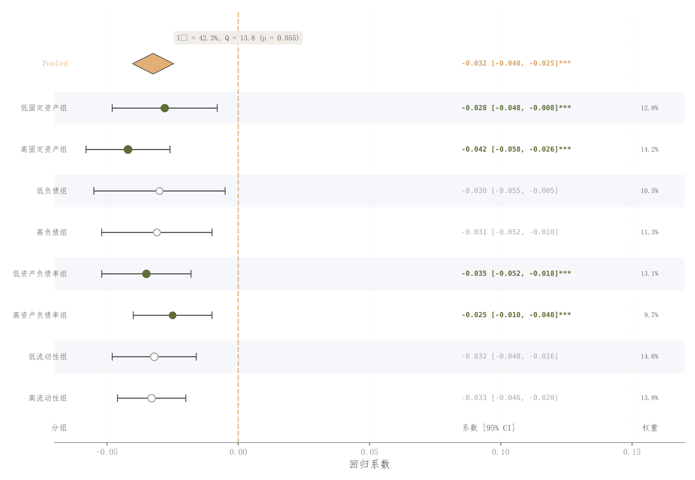

# 047 · 效应森林图与权重摘要

ID：`empirical.forest`

用途：多项效应的方向、精度和汇总结果如何？

标签：误差、比较、组合

别名：forest plot、效应区间、meta

## 数据要求

- 效应估计、CI上下界、权重、标签
- 可选显著性

## 组合结构

逐行点区间；两侧文字列；汇总菱形

## 视觉特点

- 交替行浅底
- 实心空心点
- 零线
- 菱形摘要

## 适配注意

原示例某行CI上下界倒置，且显著性布尔值独立指定；需使用真实一致的估计结果。

## 预览

## 来源与核对

原名称：Forest Plot (Stata/SCI style)
原始代码：[查看](../sources/empirical.forest/original.html)
预览范围：首个主要Python示例
已查看对应预览并核对主要绘图和数据代码；卡片不是统计有效性认证。

## 相近候选

- [分层异质性森林图](empirical.subgroup_forest.md)
- [多指标点区间与汇总菱形](advanced.dot_ci.md)

<!-- fidelity:start -->
## 源码保真要点

以当前完整配方源码为底稿；下列行号指向解释预览的快照。数据适配不应顺手删掉这些视觉结构。

### 点区间和汇总菱形

- 保留重点：保留浅交替行、带端帽的区间、空实心点、零线与汇总菱形，两侧文本按行对齐。
- 可适配：效应方向、研究数、权重与区间据实更新；空实心编码及汇总方法必须与说明一致。
- 源码：[L26–26](../sources/empirical.forest/original.html#L26) · [L33–33](../sources/empirical.forest/original.html#L33) · [L34–34](../sources/empirical.forest/original.html#L34) · [L35–35](../sources/empirical.forest/original.html#L35) · [L41–42](../sources/empirical.forest/original.html#L41) · [L45–45](../sources/empirical.forest/original.html#L45) · [L49–52](../sources/empirical.forest/original.html#L49) · [L55–56](../sources/empirical.forest/original.html#L55) · [L59–60](../sources/empirical.forest/original.html#L59) · [L61–62](../sources/empirical.forest/original.html#L61) · [L63–64](../sources/empirical.forest/original.html#L63) · [L71–71](../sources/empirical.forest/original.html#L71) · [L72–73](../sources/empirical.forest/original.html#L72) · [L74–75](../sources/empirical.forest/original.html#L74) · [L76–78](../sources/empirical.forest/original.html#L76) · [L82–85](../sources/empirical.forest/original.html#L82)

按现有审图流程对照实际输出；有疑问时可用[源码差异提示](../../template-fidelity.md)。
