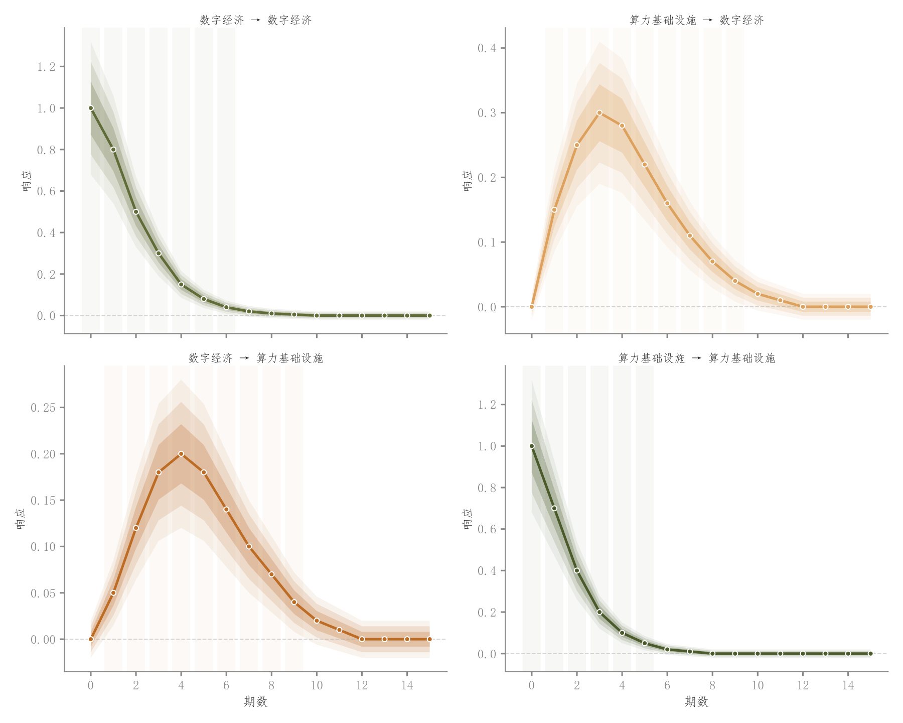

# 067 · 多路径脉冲响应四面板

ID：`empirical.impulse_response`

用途：各类冲击对响应变量的影响如何衰减？

标签：因果、趋势、误差、组合

别名：IRF、VAR、脉冲响应

## 数据要求

- 冲击—响应配对
- 各期IRF与区间

## 组合结构

2×2，每格一个响应路径

## 视觉特点

- 嵌套透明区间
- 零线
- 显著时期浅底

## 适配注意

示例响应曲线手工设定；需提供真实模型识别、期数单位和区间估计。

## 预览

## 来源与核对

原名称：Impulse Response Function (IRF with Gradient CI + Multi-Panel)
原始代码：[查看](../sources/empirical.impulse_response/original.html)
预览范围：首个主要Python示例
已查看对应预览并核对主要绘图和数据代码；卡片不是统计有效性认证。

<!-- fidelity:start -->
## 源码保真要点

以当前完整配方源码为底稿；下列行号指向解释预览的快照。数据适配不应顺手删掉这些视觉结构。

### 响应路径与嵌套区间

- 保留重点：保留各响应面板的多层透明区间、白边路径点、零线和有依据的显著时期浅底。
- 可适配：冲击/响应变量、期数及置信界由实际模型重算，布局可扩缩，不将示例曲线当实证结果。
- 源码：[L42–43](../sources/empirical.impulse_response/original.html#L42) · [L46–47](../sources/empirical.impulse_response/original.html#L46) · [L50–50](../sources/empirical.impulse_response/original.html#L50) · [L55–55](../sources/empirical.impulse_response/original.html#L55)

按现有审图流程对照实际输出；有疑问时可用[源码差异提示](../../template-fidelity.md)。
