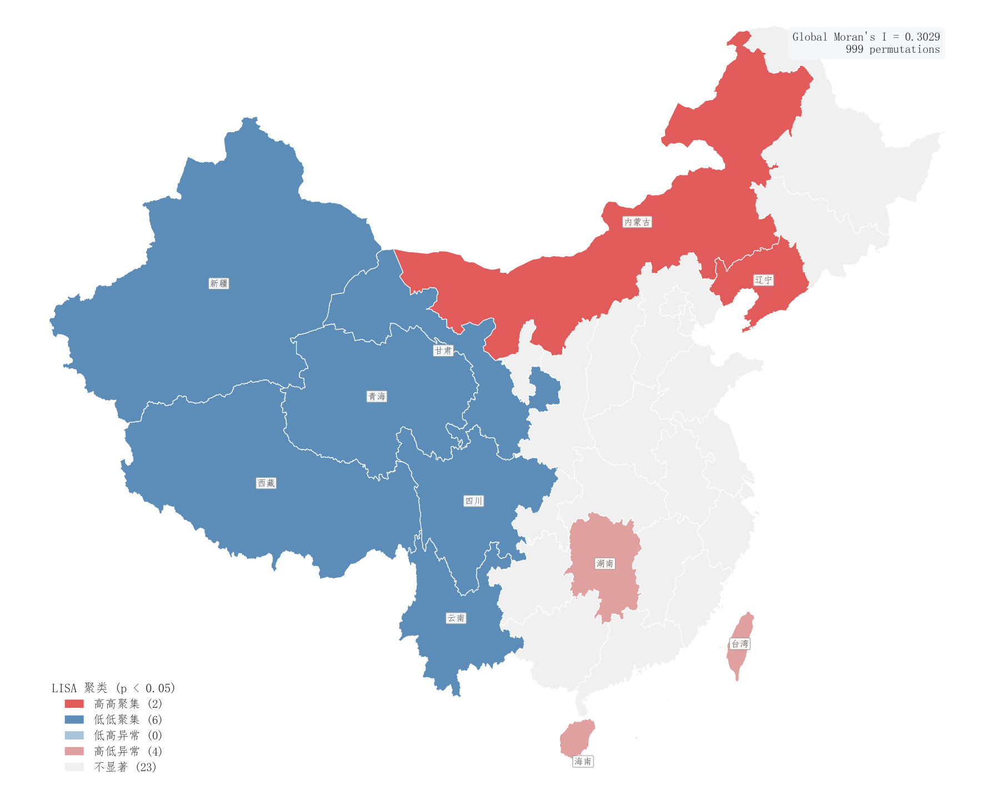

# 064 · LISA局部空间聚类地图

ID：`empirical.lisa_map`

用途：高高、低低集聚与空间异常在哪里？

标签：空间、聚类、诊断

别名：LISA、局部空间自相关

## 数据要求

- 区域边界与数值
- 空间权重及显著性口径

## 组合结构

行政区分类着色；显著地区文字

## 视觉特点

- HH、LL、HL、LH与不显著类别
- 白边界

## 适配注意

使用真实Moran_Local计算模拟数据；颜色为类别不应当连续大小；置换次数与多重比较需明确。

## 预览

## 来源与核对

原名称：LISA Cluster Map (真实局部空间自相关 + esda.Moran_Local + 中国省级地图)
原始代码：[查看](../sources/empirical.lisa_map/original.html)
预览范围：首个主要Python示例
已查看对应预览并核对主要绘图和数据代码；卡片不是统计有效性认证。

<!-- fidelity:start -->
## 源码保真要点

以当前完整配方源码为底稿；下列行号指向解释预览的快照。数据适配不应顺手删掉这些视觉结构。

### 离散空间类别和白边界

- 保留重点：保留 HH/LL/HL/LH/不显著的离散编码及白边界，不把类别变成连续强弱色阶。
- 可适配：地理单元、权重、显著性规则和类别颜色可变，类别名称与颜色映射一致。
- 源码：[L60–61](../sources/empirical.lisa_map/original.html#L60) · [L96–97](../sources/empirical.lisa_map/original.html#L96)

按现有审图流程对照实际输出；有疑问时可用[源码差异提示](../../template-fidelity.md)。
