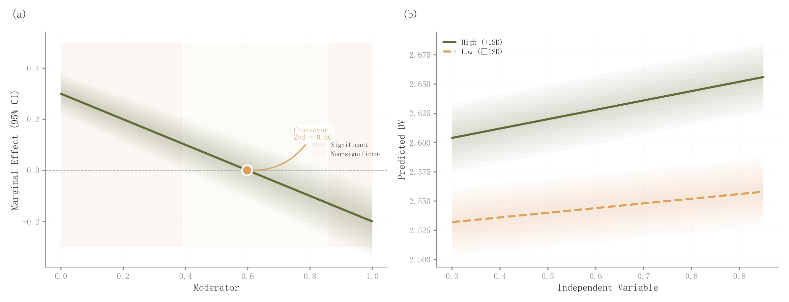

# 055 · 边际效应与条件预测双面板

ID：`empirical.marginal_effects`

用途：调节变量如何改变效应方向和条件预测？

标签：因果、解释、组合

别名：边际效应与条件预测双面板

## 数据要求

- 调节网格上的边际效应与SE
- 两种条件预测及区间

## 组合结构

左边际效应；右高低条件预测线

## 视觉特点

- 多层透明置信带
- 显著区域浅底
- 零交叉点箭头

## 适配注意

示例为直接设定曲线，未拟合交互模型；区间需与模型和条件定义一致。

## 预览

## 来源与核对

原名称：Moderation / Marginal Effects
原始代码：[查看](../sources/empirical.marginal_effects/original.html)
预览范围：首个主要Python示例
已查看对应预览并核对主要绘图和数据代码；卡片不是统计有效性认证。

<!-- fidelity:start -->
## 源码保真要点

以当前完整配方源码为底稿；下列行号指向解释预览的快照。数据适配不应顺手删掉这些视觉结构。

### 效应与条件预测双面板

- 保留重点：保留左侧多层效应区间、显著区域浅底与零交叉标记，右侧高低条件预测实虚线和各自区间。
- 可适配：条件值、效应、标准误和零交叉由当前模型计算；无交叉或无显著区时不硬保留标记。
- 源码：[L12–12](../sources/empirical.marginal_effects/original.html#L12) · [L15–15](../sources/empirical.marginal_effects/original.html#L15) · [L16–16](../sources/empirical.marginal_effects/original.html#L16) · [L17–17](../sources/empirical.marginal_effects/original.html#L17) · [L21–21](../sources/empirical.marginal_effects/original.html#L21) · [L35–35](../sources/empirical.marginal_effects/original.html#L35) · [L36–36](../sources/empirical.marginal_effects/original.html#L36) · [L37–37](../sources/empirical.marginal_effects/original.html#L37) · [L38–38](../sources/empirical.marginal_effects/original.html#L38)

按现有审图流程对照实际输出；有疑问时可用[源码差异提示](../../template-fidelity.md)。
