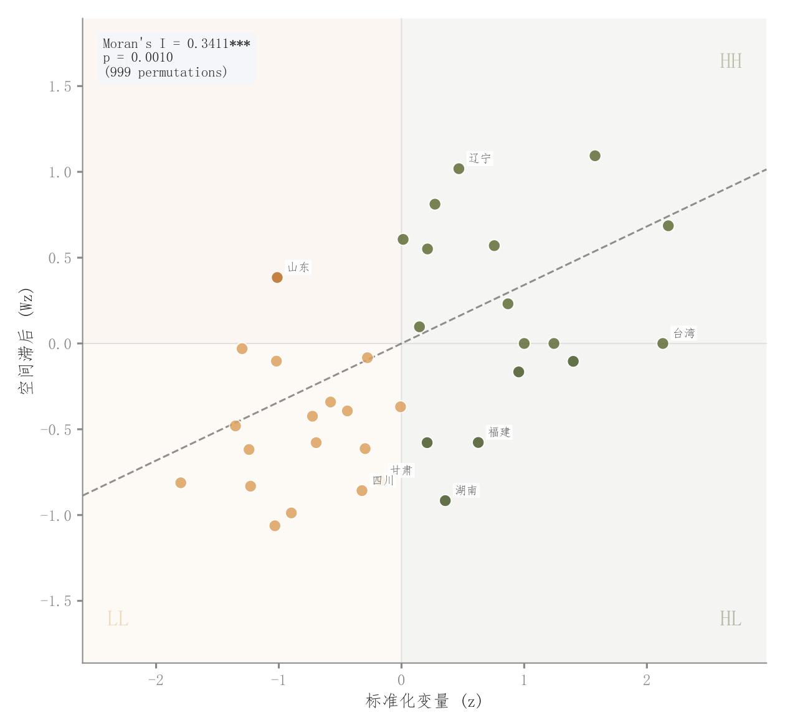

# 063 · Moran空间滞后散点

ID：`empirical.moran_scatter`

用途：地区值与邻近地区值是否存在空间关联？

标签：空间、关联、诊断

别名：Moran I、空间自相关

## 数据要求

- 区域边界
- 每区域数值
- 空间权重定义

## 组合结构

标准化值与空间滞后散点；四象限

## 视觉特点

- 象限浅底
- 回归线
- 异常区域名
- Moran统计

## 适配注意

此例真实计算Queen权重和Moran统计，但区域数值为模拟；边界与权重影响结论。

## 预览

## 来源与核对

原名称：Moran's I Scatter Plot (真实空间自相关 + esda 计算 + Queen 权重)
原始代码：[查看](../sources/empirical.moran_scatter/original.html)
预览范围：首个主要Python示例
已查看对应预览并核对主要绘图和数据代码；卡片不是统计有效性认证。

<!-- fidelity:start -->
## 源码保真要点

以当前完整配方源码为底稿；下列行号指向解释预览的快照。数据适配不应顺手删掉这些视觉结构。

### 四象限浅底与空间关联

- 保留重点：保留四象限浅底、象限点色、空间滞后轴与回归参考，不只剩普通散点。
- 可适配：空间权重、标准化值、空间滞后与 Moran 统计按实际分析计算；异常区域标签据实选择。
- 源码：[L57–57](../sources/empirical.moran_scatter/original.html#L57) · [L58–58](../sources/empirical.moran_scatter/original.html#L58) · [L59–59](../sources/empirical.moran_scatter/original.html#L59) · [L60–60](../sources/empirical.moran_scatter/original.html#L60) · [L71–71](../sources/empirical.moran_scatter/original.html#L71) · [L75–75](../sources/empirical.moran_scatter/original.html#L75)

按现有审图流程对照实际输出；有疑问时可用[源码差异提示](../../template-fidelity.md)。
